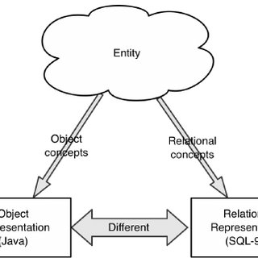
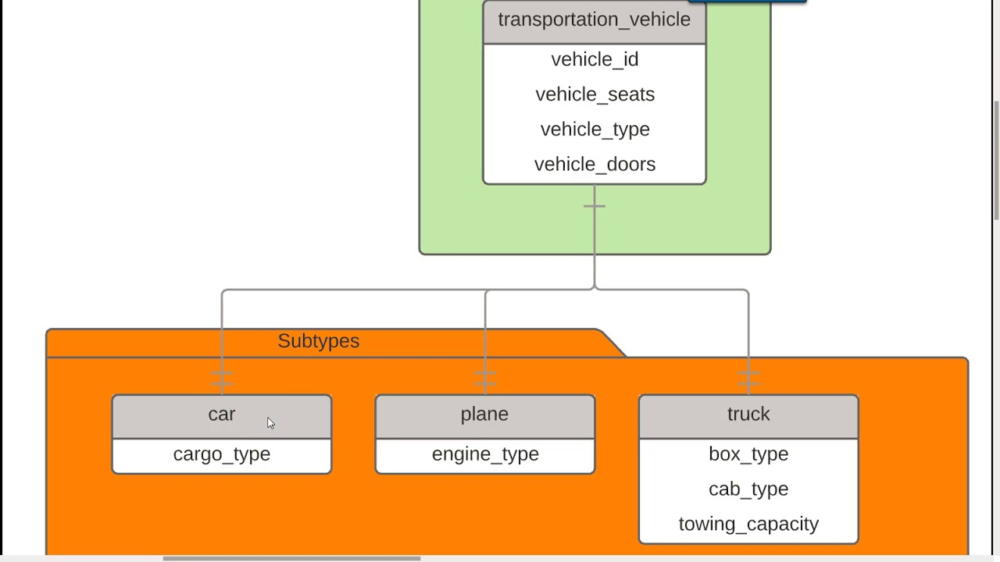
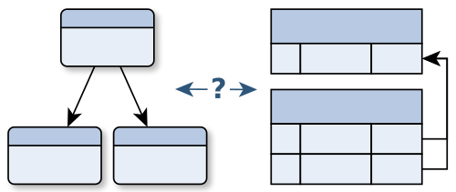
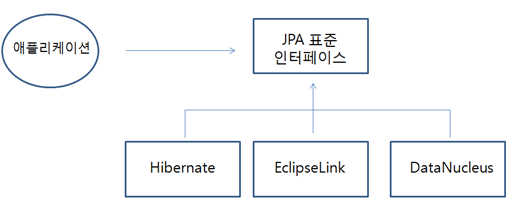

### 1장 JPA 소개

- SQL을 직접 다룰 때 발생하는 문제점
- 패러다임의 불일치
- JPA란 무엇인가


1장의 핵심 목차를 뽑아보면 위와 같다.

기존에는 마이바티스와 같은 SQL mapper를 사용했는데 이는 CRUD용 SQL을 반복해서 작성해야 하는 불편함이 있었다. 

그리고 이러한 불편함을 해소하기 위해 나온 것이 ORM(Object Relational Mapping) 프레임워크이다. JPA는 자바 진영의 ORM 기술 표준으로, 실행 시점에 자동으로 SQL을 만들어서 실행하기 때문에 개발자가 직접 SQL을 작성할 필요가 없다. 


#### SQL을 직접 다룰 때 발생하는 문제점


데이터베이스는 객체 구조와는 다른 데이터 중심의 구조를 가지므로 객체를 DB에 직접 저장하거나 조회할 수 없다. 그래서 개발자가 DB와 객체지향 애플리케이션 중간에서 **JDBC API를 사용해서 변환 작업**을 해주어야 한다. 

1. 문제는 객체를 DB에 `CRUD`하려면 너무 많은 `SQL`과 `JDBC API`를 코드로 작성해주어야 한다는 점이다.
2. 데이터 접근 계층을 사용해서 SQL을 숨겨도 어쩔 수 없이 `DAO`를 열어서 어떤 SQL이 실행되는지 확인해야 한다.
    * 비즈니스 요구사항을 모델링한 객체를 `entity`라고 하는데 이처럼 `SQL`에 의존한다면 개발자들이 `entity`를 신뢰하고 사용할 수 없다. 이런 것은 진정한 의미의 계층 분할이라고 볼 수 없다. 왜냐하면 데이터 접근 계층에 SQL과 JDBC API를 숨겨도 결국은 `DAO`를 까서 `SQL`를 확인해봐야 하기 때문이다.


#### 패러다임의 불일치
- 객체(object)와 `Relational Database`는 서로 지향하는 목적이 다르다. 이러한 것을 객체와 관계형 데이터베이스의 패러다임 불일치 문제 (The Object-Relational Impedance Mismatch) 라고 한다. 즉 객체 구조를 테이블 구조에 저장하는 데 한계가 있다는 뜻이다.
   
 

- 예를 들면, `Object`엔 **상속** 같은 개념이 있지만, 관계형 데이터베이스에는 이와 같은 개념이 없다. 이럴땐 데이터베이스 모델링에서 이야기하는 super-type, sub-type을 이용해야 한다. 
아래 구글에서 가져온 이미지를 살펴보면, 결국 `car` 데이터 하나를 저장할 때 `transportation_vehicle`테이블에도 insert해주어야 한다. 또한 `vehicle_type`도 따로 관리를 해주어야 한다. 이러한 것들이 모두 패러다임의 불일치를 해결하기 위한 비용인 것이다.

  

- 객체 그래프 탐색
   - SQL을 직접 다루면, 처음 실행하는 SQL문에 따라 객체 그래프를 어디까지 탐색할 수 있는지 정해진다. 만약 member를 조회할 때 `Team`테이블과 조인을 해서 조회를 하지 않았다면, `member.getTeam()`은 탐색할 수 없는 부분이 된다. 이처럼 언제 끊어질지 모르는 객체 그래프를 탐색하기란 어려운 일이다.
   ```java
   class MemberService {
        Member member = memberDAO.find(memberId);
        member.getTeam(); // 가능할까?
  }
   ```   
    - JPA를 사용한다면 객체그래프를 마음껏 탐색할 수 있다.
        - **지연로딩(lazy loading)** : JPA는 실제 객체를 사용하는 시점까지 데이터베이스 조회를 미룬다고 해서 지연로딩이라고 한다. 만약 `Team`까지 조회한다면 JPA가 실제로 객체를 조회하는 시점에 적절히 조인을 해서 조회를 해준다.
    

#### JPA란 무엇인가?

- JPA(Java Persistence API) : 자바 진영의 ORM 기술 표준. 쉽게 말해서 인터페이스를 모아둔 것으로 JPA를 사용하려면 JPA를 구현한 프레임워크를 선택해야한다. 현재 가장 대중적인 프레임워크는 `hibernate`이다.
  
    - ORM(Object-Relational Mapping): 객체와 관계형 데이터베이스를 매핑한다.
    
이 책에서도 hibernate를 사용하여 예제를 진행할 예정이다.
