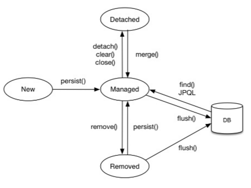

## Chapter3. 영속성 관리
이번 장에서는 매핑한 `entity`를 `entityManager`를 통해 어떻게 사용하는지를 다루게 된다.

- `entityManagerFactory`는 여러 스레드가 동시에 접근해도 안전하므로 서로 다른 스레드 간에 공유해도 도지만, `entityManager`는 여러 스레드가 동시에 접근하면 **동시성 문제가 발생하므로 스레드 간에 절대 공유해서는 안된다.**
- `entityManager`는 **데이터베이스 연결이 꼭 필요한 시점까지 connection을 얻지 않는다.**

### 영속성 컨텍스트(persistence context)란?
- entity를 영구히 저장하는 환경이란 뜻.
- entityManager로 entity를 저장하거나 조회하면 entityManager는 영속성 컨텍스트에 entity를 보관하고 관리한다.
- **영속성 컨텍스트는 엔티티매니저를 생성할 때 하나 만들어진다.**

### Entity Life Cycle


- **new/transient (비영속상태)** 
  - entityManager와 관련 없는 상태. 
  ```java
  Member member = new Member("홍길동", 30);
  ```
- **managed(영속 상태)**
    - 영속성 컨텍스트에 의해 관리되는 상태.
    - 영속 상태는 식별자 값이 반드시 있어야 한다. 없으면 예외 발생.
    ```java
  EntityManager em = entityManagerFactory.createEntityManager();
    em.persist(member);
  ```
- **detached(준영속 상태)**
  - `em.detach()`를 호출하거나 `em.close()`로 영속성 컨텍스트를 닫아버리거나 `em.clear()`로 영속성 컨텍스트를 초기화해도 영속성 컨텍스트가 관리하던 영속 상태의 엔티티는 준영속 상태가 된다.

---

### 1차 캐시와 쓰기 지연
- 영속성 컨텍스트는 내부에 캐시를 가지고 있는데 이를 **1차 캐시라**고 한다. 영속 상태의 엔티티는 모두 이곳에 저장된다. 
- 엔티티 매니저는 트랜잭션을 커밋하기 직전까지 데이터베이스에 엔티티를 저장하지 않고 내부 쿼리 저장소에 insert sql을 차곡차곡 모아둔다. 그리고 트랜잭션 커밋시에 모아둔 쿼리를 DB에 보낸다. 이를 **쓰기 지연**(transactional write-behind)라고 한다.
- 트랜잭션을 커밋하면 엔티티 매니저는 우선 영속성 컨텍스트를 flush한다. **flush는 영속성 컨텍스트의 변경 내용을 DB에 동기화하는 작업**이다. flush라는 단어가 좀 헷갈리는데 이는 DB와 영속성 컨텍스트를 동기화하는 작업임을 잊지 말자. 
  
---

### dirty checking
- dirty checking(변경 감지) : entity의 변경사항을 DB에 자동으로 반영하는 기능.
- JPA는 엔티티를 영속성 컨텍스트에 보관할 때, 최초 상태를 복사해서 저장해둔다. 이를 snapshot이라고 한다. flush시점에 snapshot과 entity를 비교하여 변경된 entity를 찾는다. 그래서 `em.update()`는 존재하지 않는다. 
  ```java
  member.setName("김길동");
  em.persist(member);
  ```
  위와 같이 하면 `name` 필드만 업데이트 될 것으로 예상할 수 있지만, JPA는 모든 필드를 업데이트한다. 이렇게 모든 필드를 사용하면 데이터베이스에 보내는 **데이터 전송량이 증가하는 단점**이 있다. 하지만 모든 필드를 사용해서 update하면 `update` 쿼리가 항상 같으므로 **update 쿼리를 재사용**할 수 있다는 장점이 있다. 하지만 필드 갯수가 너무 많거나 저장되는 내용이 너무 크면 수정된 데이터만 사용해서 동적으로 update sql을 사용하는 전략을 택할 수도 있다. 
  ```java
  @org.hibernate.annotations.DynamicUpdate
  ```
    - 컬럼이 대략 30개 이상이 되면 default 방법인 정적 수정 쿼리보다 `@DynamicUpdate`를 사용하는 동적 쿼리가 더 빠르다고 한다. 이에 대해선 테스트를 해보고 판단하는게 좋을 듯 하다.

---

### 준영속 상태(detached)와 영속성 컨텍스트가 제공하는 것들
- em.detach(entity)
- em.clear()
- em.close()

위 3가지의 경우에 준영속 상태가 된다. **준영속 상태는 entity를 영속성 컨텍스트에서 분리**한다(detached)는 것을 의미한다. 더이상 영속성 컨텍스트가 해당 객체를 관리하지 않게 되는 것으로, **영속성 컨텍스트가 제공하는 기능들을 사용할 수 없게 된다**.

entity가 준영속 상태가 되면 위에 있는 영속성 컨텍스트가 제공하는 기능들을 이용하지 못하게 된다.
그러므로 준영속 상태는 비영속 상태와 거의 같은 상태로 볼 수 있다. 그러나 비영속 상태는 식별자 값이 없을 수 있지만, **준영속 상태는 이미 한번 영속되었던 상태이므로 식별자를 가진다.**

---

### <영속성 컨텍스트가 제공하는 기능들 정리>
- **1차 캐시** : 오직 식별자로 쿼리할 때만 가능하다. 
    ```java
  em.find(id);  
  ```
- **쓰기 지연** (transactional write-behind) : update/save 시에 커리를 쓰기 지연 저장소에 가지고 있다가 트랜잭션이 커밋되는 순간 한번에 DB에 쿼리를 날리는 것으로, DB커넥션 시간을 줄일 수 있다는 장점이 있다.
- **변경 감지** (dirty checking) : entity의 변경사항을 DB에 자동으로 반영하는 기능.
- **지연 로딩** (lazy loading) : **실제 entity 대신 `proxy` 객체를 로딩해두고 해당 entity를 실제 사용할 때 영속성 컨텍스트를 통해 데이터를 불러오는 방법**. 추후에 더 자세히 살펴보겠다. 지금은 이정도로만 알아두고 넘어간다.


---

### 참고자료
- https://jobc.tistory.com/209

# AnalysisFlow.findReviewSummary() 메소드 리뷰 내용


```java
ReviewSummaryRdo reviewSummaryRdo = new ReviewSummaryRdo();
SurveySummary surveySummary = surveySummaryService.findSurveySummary(surveyCaseId);
AnswerSummary answerSummary = surveySummary.getAnswerSummaries().get(0); // 1번째 문항 (Review type)
reviewSummaryRdo.setAnswerSummary(answerSummary);
```


SurveySummary.answerSummaries 는 `transient`이다. Domain 클래스의 transient는 값을 관리하는 용도 아니라, 클래스 다이어그램에서 dependency 표시 등 관계 표현을 위해서 사용한다.
그러므로, 위 코드에서 SurveySummary 조회 후 getAnswerSummaries() 호출 시 NullPointerException 발생.
AnswerSummary는 별도로 조회해야 함.