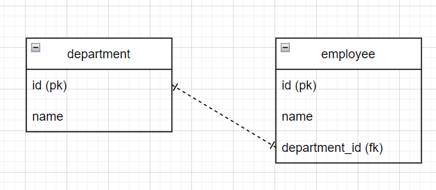
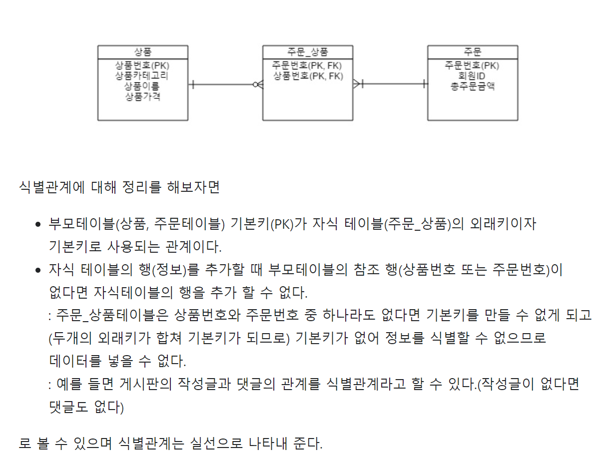
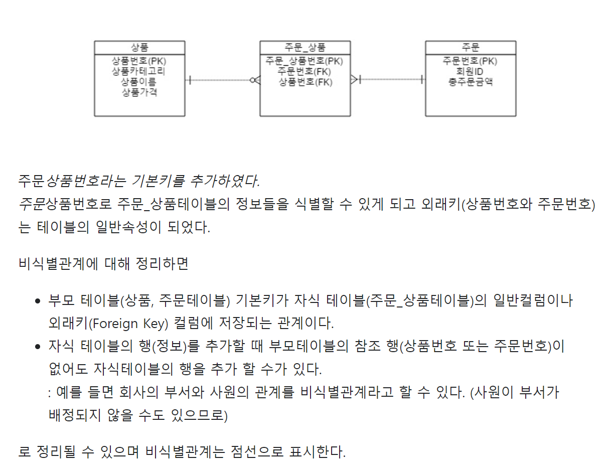
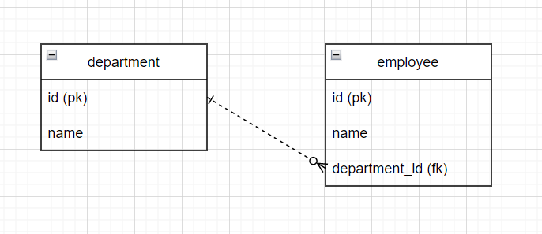
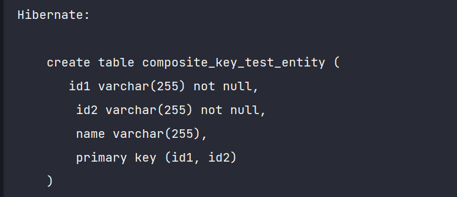
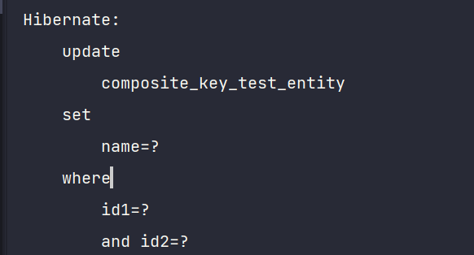
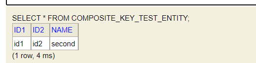

## Chapter 5 - 7

5장,6장은 **연관관계 매핑**에 대한 부분을 다루고, 7장은 **고급매핑**에 대해 소개하는데 정리하다보니 연관도가 높아 한꺼번에 정리하는게 보기 좋을 것 같아 한 파일에 정리하게 되었다.


5-6장에서 눈여겨볼 개념은 "연관관계의 주인"이었다. 즉 객체 연관관계와 테이블 연관관계에서 오는 차이로 인해 이러한 개념이 필요하다.


[TOC]


---


### 객체 연관관계와 테이블 연관관계의 차이

- <u>참조를 통한 연관관계는 언제나 단방향</u>이다. 그러므로 **객체에서는** 양방향 연관관계란 존재하지 않고, 양방향처럼 보이도록 하기 위해 단방향 연관관계를 양쪽에 만드는 방법이 있다. 즉 **서로 다른 단방향 연관관계가 2개 존재**하게 되는 것이다.
  - 객체는 참조를 사용해서 연관관계를 탐색할 수 있고, 이러한 것을 "**객체 그래프 탐색**"이라고 한다.
- 반면 **테이블 연관관계의 경우 외래키 하나로 양방향으로 조인**할 수 있다.


아래는 단방향 매핑 예제이다.

### @JoinColumn

- 외래키를 매핑할 때 사용하는 어노테이션
- `@JoinColumn` 어노테이션을 생략하면, 외래키를 찾을 때 기본 전략을 사용한다.
  - 기본전략 : 필드명_참조하는 테이블의 컬럼명
  - ex) team_TEAM_ID

### @ManyToOne

- 다대일 관계

```java

@Getter
@Setter
@Entity(name = "book_MEMBER")
public class Member {
    //
    @Id
    @Column(name = "MEMBER_ID")
    private String id;

    //연관관계 매핑
    @ManyToOne
    @JoinColumn(name = "TEAM_ID")
    private Team team;
}

```


---


### 연관관계의 주인

- 위에서 언급했다시피 테이블 연관관계와 객체 연관관계 간에는 차이가 존재한다. 테이블에서는 하나의 외래키로 양방향 연관관계를 맺을 수 있지만, 객체에서는 단방향 연관관계를 2개 만들어야 한다. 그러므로 **JPA에서는 두 객체 연관관계 중 하나를 정해서 테이블의 외래키를 관리**하도록 한다**. 외래키를 관리하는 쪽을 "연관관계의 주인"**이라고 칭한다.
- 연관관계의 주인만이 CUD를 할 수 있고, 주인이 아닌 쪽은 read만 할 수 있다.
- 주인은 `mapped by` 속성을 사용하지 않는다.


만약 양방향매핑을 할 경우 


### 양방향 매핑의 장단점

- 양방향의 장점은 <u>반대방향으로 객체</u> <u>그래프 탐색 기능이 추가된 것 뿐, 단방향과 비교해서 복잡</u>하다. 그러므로 객체에서 양방향 연관관계를 사용하려면 로직을 견고하게 짜야 한다.

  

  

---

### 식별관계와 비식별관계 (7장)

- **식별관계 (Identifying relationship)** : 부모테이블의 기본키를 내려받아서 자식테이블의 기본키 + 외래키로 사용하는 관계.
- 식별관계는 실선으로 나타낸다.
- 비식별관계 (Non-identifying relationship)
  - **필수적 비식별관계 (mandatory)** : 외래키에 nul 비허용
  - **선택적 비식별관계 (optional)** : 외래키에 null허용, 연관관계를 맺을지 말지 선택할 수 있다.
- 최근에는 비식별관계를 주로 사용하고 꼭 필요한 곳에만 식별관계를 사용하는 추세라고 한다.


*이 식별관계와 비식별관계에 대해 책에 내용이 조금 부족한 것 같아서 (아무래도 좀더 db관련 부분이니까) 참고자료를 보고, 내용을 추가한다. 공부를 하면서 참고한 자료들은 목차 최하단에 모아두었다.* *아래 이미지는 타 블로그에서 가져온 내용인데, 잘 정리되어있는 듯하다.*

식별관계의 경우, 부모테이블의 pk가 자식테이블의 fk이자 pk로 사용되어, 자식테이블에 row(data) 추가할 때마다 부모테이블의 pk가 (자식테이블의 fk이자 pk) 존재해야한다. 그렇지 않으면 자식테이블에 insert할 수 없게 된다.  **즉 부모테이블에 자식테이블이 종속된다.**



> <식별관계의 장점>
>
> - 데이터의 정합성 유지를 DB에서 한번 더 할 수 있다.
> - 자식테이블에 데이터가 존재한다면, 부모 데이터도 반드시 존재한다고 보장할 수 있다.
>
> 
>
> <식별관계의 단점>
>
> - 요구사항이 변경되었을 경우 구조변경이 어렵다.



비식별관계의 경우 부모테이블의 pk를 참조하여 **일반컬럼으로** 갖고 있고, 자식테이블의 pk는 따로 있는 경우이다. 그러므로 이 경우에는 **자식테이블의 fk(즉, 부모테이블의 pk)를 null허용할지 말지 결정할 수 있다.**



아래 **비식별관계 예시**를 만들어보았다.

부서와 직원 사이에 일대다 관계(한 부서에서 여러명의 직원이 일하며, 직원은 하나의 부서에만 배정될 수 있다)를 맺고 있고, 직원은 아직 부서가 미배정된 상태(department_id : null)를 허용한다. 

- 부서에 여러 사원이 속한다. 사원은 여러 부서를 가질 수 없다.
- 부서를 아직 배정받지 않은 사원이 존재할 수 있다.




> <비식별관계의 장점>
>
> - 변경되는 요구사항을 유동적으로 수용할 수 있다.
> - 부모 데이터와 독립적인 자식 데이터를 생성할 수 있다.
>
> <비식별관계의 단점>
>
> - 데이터 정합성을 지키기 위해 별도의 로직이 필요하다.
> - 자식 데이터가 존재해도 부모데이터가 존재하지 않을 수 있다.
> - 즉 데이터 무결성을 보장하지 않는다.


---


### 복합 키 (composite key)

​	복합키(6,7장) 와(새로운 값 타입 정의 (9장)

- 주의 : 복합키에는 `@GenerateValue`를 사용할 수 없다. 복합키를 구성하는 여러 컬럼 중 하나에도 사용할 수 없다.

JPA에서는 복합키를 지원하기 위해 `@IdClass`와 `@EmbeddedId` 2가지 방법을 제공한다.

- 전자는 관계형 데이터베이스에 가까운 방법
- 후자는 좀더 객체지향에 가까운 방법

> 아래 내용은 6장 228쪽
>
> - 복합키는 별도의 식별자 클래스로 만들어야 한다.
> - Serializable을 구현해야 한다.
> - equals, hashCode 메서드를 구현해야 한다.
> - 기본 생성자가 있어야 한다.
> - 식별자 클래스는 public이여야 한다.
> - `@IdClass` 사용하는 방법 외에 `@EmbeddedId`를 사용하는 방법도 있다.

- 참고했던 블로그 링크 : https://1minute-before6pm.tistory.com/17

+ @EmbeddedId와 관련된 자세한 내용은 **9장을 참고**하면 된다.

책 9장에 보면 Member 클래스 (회원 클래스)를 더욱 응집력 있게 만들기 위해 `@Embeddable` 어노테이션을 사용하였다. 책에서 **Member클래스는 이름, 근무기간(근무시작일, 근무종료일). 집주소(주소도시, 주소번지, 주소 우편번호) 정보를 가지는데 근무시작일과 우편번호는 서로 아무런 관련이 없다. 즉 이러한 상태는 응집도가 낮다**고 볼 수 있다. 그러므로 위 정보들을 **관련있는 것끼리 묶어서 새로운 값 타입으로 정의할 경우 응집도도 높아지고, 새로운 값 타입으로 생성된 클래스들은 재사용이 가능해진다는 장점**을 갖게 된다.


아래와 같이 값 타입을 정의하면, 이를 `@EmbeddedId`를 붙여 쓸 수 있다.

```java
@AllArgsConstructor
@NoArgsConstructor
@Embeddable
@Getter
public class CompositeId implements Serializable {
    //
    private String a;
    private String b;
}

```

```java
@Entity(name = "Test")
public class Test {
    //
    @EmbeddedId
    private CompositeId id; // 복합키
}
```


아래는 `@IdClass` 어노테이션 사용법이다.

```java
@Entity
@IdClass(CompositeId.class)
public class Test {
    //
    @Id
    private String a;
    @Id
    private String b;
}
```

```java
@AllArgsConstructor
@NoArgsConstructor
@Getter
public class CompositeId implements Serializable {
    //
    private String a;
    private String b;
}
```


중요한 사항은 `equals()`와 `hashCode`()를 오버라이드해야 한다는 점이다.

왜냐면 **영속성 컨텍스트는 엔티티의 식별자(@Id)를 key로 사용해서 엔티티를 관리하기 때문이다. 그리고 식별자를 비교할 때 equals()와 hashCode() 를 사용한다. 그러므로  식별자의 동등성이 보장되지 않으면, 예상과 다른 엔티티가 조회되거나 엔티티를 찾을 수 없는 등 영속성 컨텍스트가 엔티티를 관리하는 데 심각한 문제가 발생**하게 되기 때문이다.


아래는 테스트해본 코드이다.

테스트용 엔티티

```java
@Getter
@Setter
@NoArgsConstructor
@AllArgsConstructor
@Entity
public class CompositeKeyTestEntity {
    //
    @EmbeddedId
    private CompositeKey id;
    private String name;
}
```


hashCode와 equals메서드를 오버라이드했을 때 

```java
import lombok.AllArgsConstructor;
import lombok.Getter;
import lombok.NoArgsConstructor;
import lombok.Setter;

import javax.persistence.Embeddable;
import java.io.Serializable;
import java.util.Objects;

@Getter
@Setter
@Embeddable
@NoArgsConstructor
@AllArgsConstructor
public class CompositeKey implements Serializable {
    //
    private String id1;
    private String id2;

    @Override
    public boolean equals(Object o) {
        if (this == o) return true;
        else if (o != null && this.getClass() == o.getClass()) {
            CompositeKey that = (CompositeKey) o;
            return id1.equals(that.id1) && id2.equals(that.id2);
        } else {
            return false;
        }

    }

    @Override
    public int hashCode() {
        return Objects.hash(id1, id2);
    }
}

```

오버라이드하고 나니 같은 키로 인식하여 테스트코드를 실행시켜보니 update문을 실행하는 것을 확인할 수 있었다.

```java
  @Test
    void composite_key_test() {
        //
        CompositeKeyTestEntity ckte = new CompositeKeyTestEntity();
        ckte.setId(new CompositeKey("id1", "id2"));
        ckte.setName("first");
        compositeKeyTestRepository.save(ckte);

        CompositeKeyTestEntity ckte2 = new CompositeKeyTestEntity();
        CompositeKey ck2 = new CompositeKey("id1", "id2");
        ckte2.setId(ck2);
        ckte2.setName("second");
        compositeKeyTestRepository.save(ckte2);

        CompositeKeyTestEntity result = compositeKeyTestRepository.findById(new CompositeKey("id1", "id2")).orElse(null);
        System.out.println("result -> " + result.getName());


    }
```

이렇게 복합키를 생성해주는 것을 확인할 수 있다.



두번째 save()시에 기본키가 같으므로(equals()오버라이드 통해 같은 키로 인식) update문을 발생시키는 것을 볼 수 있다.


* 나중에 equals, hashCode를 지우고 테스트코드를 실행해봤는데, 그럼에도 여전히 update문이 실행되는 이유는 뭘까?? (추후 내용 보완 필요!)


---


### 별도

- 그런데 MSA에서는 서비스마다 별도의 DB가 존재하므로 이러한 연관관계 매핑을 사용하지 않게 되는 것 같다. 같은 서비스 내에서 연관관계 매핑이 필요하다면 사용할 수 있겠지만 말이다.

- 책에서는 spring을 제외한 순수 JPA로 예제를 만들고 있는데  나는 springboot 환경에서 해당 예제를 해보려고 하니 다른 부분이 많아서 아직 시행착오를 겪고 있다. 추후 해결하게 되는대로 코드를 좀더 추가하려고 한다. 


### 참고자료

- https://velog.io/@jch9537/DATABASE-%EC%8B%9D%EB%B3%84%EA%B3%BC-%EB%B9%84%EC%8B%9D%EB%B3%84-%EA%B4%80%EA%B3%84

- https://velog.io/@lzhxxn/ANSI-SQL-%EC%95%8C%EC%95%84%EB%B3%B4%EC%9E%90
