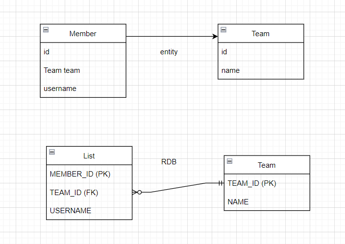

## Chapter 5 - 7

5장,6장은 **연관관계 매핑**에 대한 부분을 다루고, 7장은 **고급매핑**에 대해 소개하는데 정리하다보니 연관도가 높아 한꺼번에 정리하는게 보기 좋을 것 같아 한 파일에 정리하게 되었다.


5-6장에서 눈여겨볼 개념은 "연관관계의 주인"이었다. 즉 객체 연관관계와 테이블 연관관계에서 오는 차이로 인해 이러한 개념이 필요하다.


[TOC]


---


### 객체 연관관계와 테이블 연관관계의 차이

- <u>참조를 통한 연관관계는 언제나 단방향</u>이다. 그러므로 **객체에서는** 양방향 연관관계란 존재하지 않고, 양방향처럼 보이도록 하기 위해 단방향 연관관계를 양쪽에 만드는 방법이 있다. 즉 **서로 다른 단방향 연관관계가 2개 존재**하게 되는 것이다.
  - 객체는 참조를 사용해서 연관관계를 탐색할 수 있고, 이러한 것을 "**객체 그래프 탐색**"이라고 한다.
- 반면 **테이블 연관관계의 경우 외래키 하나로 양방향으로 조인**할 수 있다.




아래는 단방향 매핑 예제이다.

### @JoinColumn

- 외래키를 매핑할 때 사용하는 어노테이션
- `@JoinColumn` 어노테이션을 생략하면, 외래키를 찾을 때 기본 전략을 사용한다.
  - 기본전략 : 필드명_참조하는 테이블의 컬럼명
  - ex) team_TEAM_ID

### @ManyToOne

- 다대일 관계

```java

@Getter
@Setter
@Entity(name = "book_MEMBER")
public class Member {
    //
    @Id
    @Column(name = "MEMBER_ID")
    private String id;

    //연관관계 매핑
    @ManyToOne
    @JoinColumn(name = "TEAM_ID")
    private Team team;
}

```


---


### 연관관계의 주인

- 위에서 언급했다시피 테이블 연관관계와 객체 연관관계 간에는 차이가 존재한다. 테이블에서는 하나의 외래키로 양방향 연관관계를 맺을 수 있지만, 객체에서는 단방향 연관관계를 2개 만들어야 한다. 그러므로 **JPA에서는 두 객체 연관관계 중 하나를 정해서 테이블의 외래키를 관리**하도록 한다**. 외래키를 관리하는 쪽을 "연관관계의 주인"**이라고 칭한다.
- 연관관계의 주인만이 CUD를 할 수 있고, 주인이 아닌 쪽은 read만 할 수 있다.
- 주인은 `mapped by` 속성을 사용하지 않는다.


만약 양방향매핑을 할 경우 


### 양방향 매핑의 장단점

- 양방향의 장점은 <u>반대방향으로 객체</u> <u>그래프 탐색 기능이 추가된 것 뿐, 단방향과 비교해서 복잡</u>하다. 그러므로 객체에서 양방향 연관관계를 사용하려면 로직을 견고하게 짜야 한다.

- 

- 

  

---


### 복합 키 (composite key)

​	복합키(6,7장) 와(새로운 값 타입 정의 (9장)


JPA에서는 복합키를 지원하기 위해 `@IdClass`와 `@EmbeddedId` 2가지 방법을 제공한다.

- 전자는 관계형 데이터베이스에 가까운 방법
- 후자는 좀더 객체지향에 가까운 방법

> 아래 내용은 6장 228쪽
>
> - 복합키는 별도의 식별자 클래스로 만들어야 한다.
> - Serializable을 구현해야 한다.
> - equals, hashCode 메서드를 구현해야 한다.
> - 기본 생성자가 있어야 한다.
> - 식별자 클래스는 public이여야 한다.
> - `@IdClass` 사용하는 방법 외에 `@EmbeddedId`를 사용하는 방법도 있다.

- 참고했던 블로그 링크 : https://1minute-before6pm.tistory.com/17

+ @EmbeddedId와 관련된 자세한 내용은 **9장을 참고**하면 된다.

책 9장에 보면 Member 클래스 (회원 클래스)를 더욱 응집력 있게 만들기 위해 `@Embeddable` 어노테이션을 사용하였다. 책에서 **Member클래스는 이름, 근무기간(근무시작일, 근무종료일). 집주소(주소도시, 주소번지, 주소 우편번호) 정보를 가지는데 근무시작일과 우편번호는 서로 아무런 관련이 없다. 즉 이러한 상태는 응집도가 낮다**고 볼 수 있다. 그러므로 위 정보들을 **관련있는 것끼리 묶어서 새로운 값 타입으로 정의할 경우 응집도도 높아지고, 새로운 값 타입으로 생성된 클래스들은 재사용이 가능해진다는 장점**을 갖게 된다.


아래와 같이 값 타입을 정의하면, 이를 `@EmbeddedId`를 붙여 쓸 수 있다.

```java
@AllArgsConstructor
@NoArgsConstructor
@Embeddable
@Getter
public class CompositeId implements Serializable {
    //
    private String a;
    private String b;
}

```

```java
@Entity(name = "Test")
public class Test {
    //
    @EmbeddedId
    private CompositeId id; // 복합키
}
```


아래는 `@IdClass` 어노테이션 사용법이다.

```java
@Entity
@IdClass(CompositeId.class)
public class Test {
    //
    @Id
    private String a;
    @Id
    private String b;
}
```

```java
@AllArgsConstructor
@NoArgsConstructor
@Getter
public class CompositeId implements Serializable {
    //
    private String a;
    private String b;
}
```


중요한 사항은 `equals()`와 `hashCode`()를 오버라이드해야 한다는 점이다.

왜냐면 **영속성 컨텍스트는 엔티티의 식별자(@Id)를 key로 사용해서 엔티티를 관리하기 때문이다. 그리고 식별자를 비교할 때 equals()와 hashCode() 를 사용한다. 그러므로  식별자의 동등성이 보장되지 않으면, 예상과 다른 엔티티가 조회되거나 엔티티를 찾을 수 없는 등 영속성 컨텍스트가 엔티티를 관리하는 데 심각한 문제가 발생**하게 되기 때문이다.


---


### 별도

- 그런데 MSA에서는 서비스마다 별도의 DB가 존재하므로 이러한 연관관계 매핑을 사용하지 않게 되는 것 같다. 같은 서비스 내에서 연관관계 매핑이 필요하다면 사용할 수 있겠지만 말이다.

- 책에서는 spring을 제외한 순수 JPA로 예제를 만들고 있는데  나는 springboot 환경에서 해당 예제를 해보려고 하니 다른 부분이 많아서 아직 시행착오를 겪고 있다. 추후 해결하게 되는대로 코드를 좀더 추가하려고 한다. 


### 참고자료

