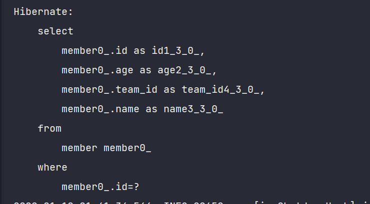
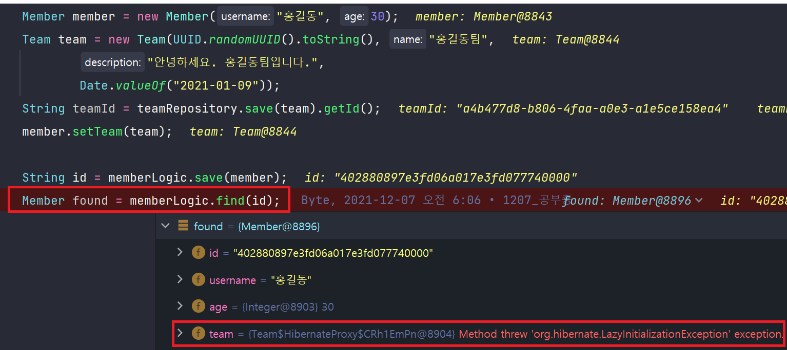
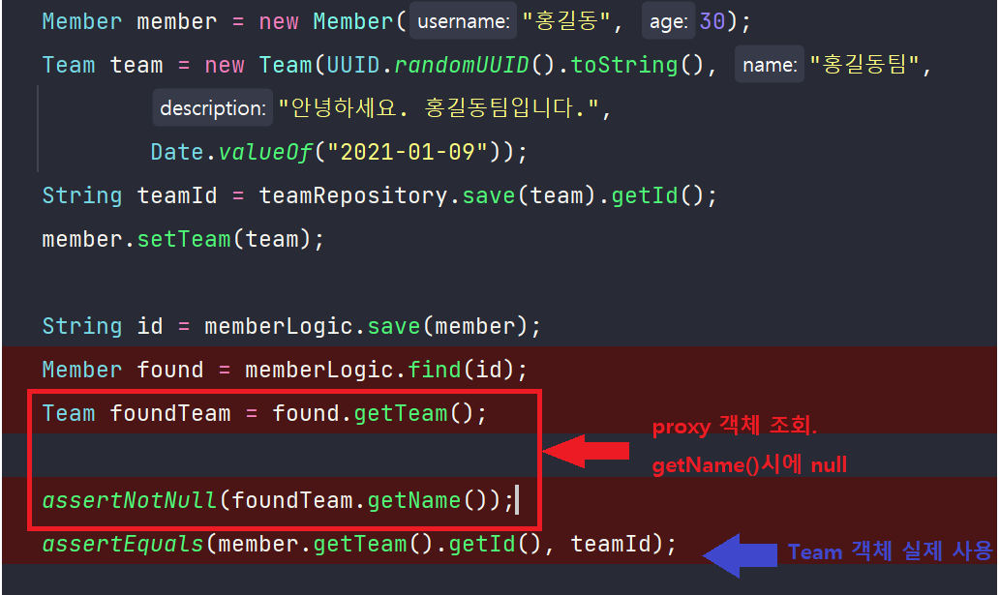
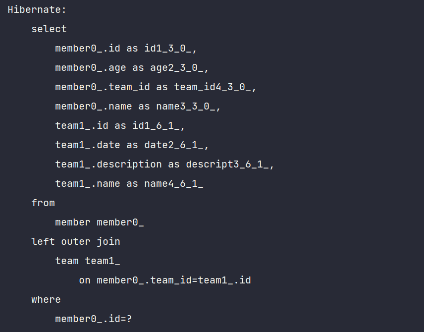
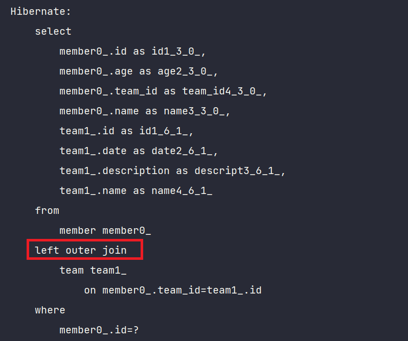
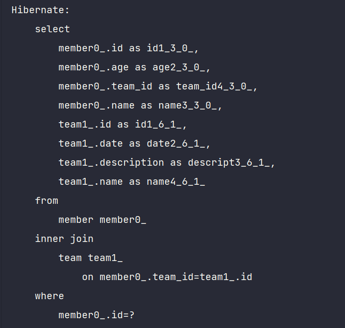

# ch8. 프록시와 연관관계 관리

요번 챕터는 정말 재밌었당


[TOC]


> <chapter1에서 공부한 내용>
>
> JPA를 사용한다면 객체그래프를 마음껏 탐색할 수 있다.
>
> - **지연로딩(lazy loading)** : JPA는 실제 객체를 사용하는 시점까지 데이터베이스 조회를 미룬다고 해서 지연로딩이라고 한다. 만약 `Team`까지 조회한다면 JPA가 실제로 객체를 조회하는 시점에 적절히 조인을 해서 조회를 해준다.

JPA는 객체를 실제 사용하는 시점까지 DB조회를 지연하는 방법을 제공한다. 이는 앞서 공부했듯이 "lazy loading(지연로딩)"이라고 한다. **지연로딩 기능을 사용하려면 실제 엔티티 객체 대신에 DB 조회를 지연할 수 있는 가짜 객체**가 필요한데, 이를 **Proxy 객체**라고 한다.


---


**JPA 표준 명세는 지연로딩 구현 방법을 JPA구현체에 위임했다. 그러므로 아래부터의 내용은 hibernate 구현체에 대한 내용**이다. 하이버네이트는 2가지 방법을 제공하는데, **1. 프록시 사용 2. 바이트 코드 사용**. 책에서는 1번에 대해서만 다룬다고 한다.


## proxy 기초

- JPA에서 entity 하나를 조회할 때, `EntityManager.find()`를 사용한다. 이 메서드는 영속성 컨텍스트에 엔티티가 없으면 DB를 조회한다. 엔티티를 실제 사용하는 시점까지 DB조회를 미루고 싶으면, `EntityManager.getReference()`를 사용하면 된다. 이 메서드 호출시 JPA는 DB조회하지 않고, 실제 엔티티 객체도 생성하지 않으며 데이터베이스접근을 위임한 proxy객체를 리턴한다.
- 프록시 클래스는 실제 클래스를 상속받아서 만들어지므로 **실제 클래스와 겉모양이 같다**. 사용자 입장에서는 굳이 실제 객체인지 프록시인지 구분하지 않고 사용하면 된다.
- 프록시 객체는 **실제 객체에 대한 참조(target)를 보관**한다. 그리고 프록시 객체의 메서드를 호출하면 프록시 객체는 실제 메서드를 호출한다.
- **프록시 객체의 초기화** : `memger.getName()`과 같이 실제 사용될 때 데이터베이스를 조회하고, 실제 엔티티 객체를 생성하는데 이것을 프록시 객체의 초기화 라고 한다.
- 프록시 객체는 처음 사용할 때 한번만 초기화된다.
- 프록시 객체가 초기화되면 프록시 객체를 통해서 실제 엔티티에 접근할 수 있다.
- 영속성 컨텍스트에 엔티티가 이미 있으면 DB를 조회할 필요가 없으므로 `EntityManager.getReference()`를 호출하더라도 프록시가 아닌, 실제 엔티티를 반환한다.
- **영속성 컨텍스트의 도움을 받을 수 없는, 준영속 상태의 프록시를 초기화하면 문제가 발생**한다. 하이버네이트는 `LazyInitializationException`을 발생시킨다.
- 엔티티를 프록시로 조회할 때 식별자(PK)값을 parameter로 전달하는데, **프록시 객체는 이 식별자 값을 보관**한다. 그러므로 식별자 값을 조회하는 `memger.getId()`를 호출해도 프록시를 초기화하지 않는다. 단 엔티티 접근방식을 `@Access(AccessType.PROPERTY)`로 설정했을 때만 해당된다. 접근방식을 `AccessType.FILED`로 설정하면 JPA는 `getId()`메서드가  `id`만 조회하는 메서드인지, 다른 필드까지 활용해서 어떤 일을 하는 메서드인지 알지 못하므로 프록시 객체를 초기화한다.


## 즉시로딩과 지연로딩

- 즉시로딩: 엔티티 조회시 연관된 엔티티도 함께 조회한다.
- 지연로딩: 연관된 엔티티를 실제 사용할 때 조회한다.


###  @ManyToOne(fetch = FetchType.LAZY) 예시

```java
@NoArgsConstructor
@Entity
@Table(name = "MEMBER")
public class Member {
    //
    @Id
    @GeneratedValue(generator = "USER_GENERATOR")
    @GenericGenerator(name = "USER_GENERATOR", strategy = "uuid")
    private String id;
    @Column(name = "NAME")
    private String username;
    private Integer age;

    //항상 @ManyToOne이 연관관계의 주인이 된다
    @ManyToOne(fetch = FetchType.LAZY)
    @JoinColumn(name = "team_id")
    private Team team;
}
```

지연로딩으로 설정해두고 member를 조회했을 때 Team은 조회하지 않는 것을 확인할 수 있다.

```java
Member member = new Member("홍길동", 30);
String id = memberLogic.save(member);

Member found = memberLogic.find(id);
```



그리고 아래 코드를 보면, member 조회시에 team은 proxy객체로 가져옴을 알 수 있다. 왜냐면 아직 팀 객체를 사용하지 않기 때문이다. 그래서 exception을 발생한다는 경고도 볼 수 있따.



그래서 아래 테스트코드에서 `assertNotNull(foundTeam.getName())`은 통과하지 못한다.

왜냐면 `memgerLogic.find(id)` 했을 때는 lazy loading 이기 때문에 Team만 DB에서 조회해온 상태고, Team객체는 아직 사용하지 않았으니 프록시 객체를 가져오기 때문이다. 




## FetchType.EAGER

eager전략으로 바꾸고 다시 테스트코드를 실행하면 성공하는 것을 확인할 수 있다.

아래 sql문을 보면 eager전략일 땐 join을 해서 team까지 조회하기 때문이다.



---


### Null 제약조건과 JPA조인 전략

위에서 보다시피 eager전략으로 join시에 inner join이 아니라, **left outer join**을 사용하는 걸 확인할 수 있다.



왜 outer join을 사용할까?

그 이유는 member테이블의 team_id 외래키가 null값을 허용하고 있기 때문이다. 그러면 team에 소속되지 않은 member가 존재할 수 있고, inner join(내부조인)을 하게되면, 조회되지 않은 멤버가 생길 수 있기 때문이다.

그러므로 JPA는 이런 상황을 고려하여 외부조인을 한다. 그러나 성능면에서 외부조인보다 내부조인이 유리하다. 그래서 내부조인을 하도록 만들려면 fk에 not null 제약조건을 걸고, `@JoinColumn(name = "team_id", nullable = false)`와 같이 설정을 걸어주면 JPA는 외부조인 대신에 내부조인을 사용하게 된다.

```java
@ManyToOne(fetch = FetchType.EAGER)
@JoinColumn(name = "team_id", nullable = false)
private Team team;
```





---


## proxy와 collection wrapper

- 하이버네이트는 엔티티를 영속 상태로 만들 때**, 엔티티에 컬렉션이 있으면 컬렉션을 추적하고 관리할 목적으로 원본 컬렉션을 하이버네이트가 제공하는 내장 컬렉션으로 변경**하는데 이것을 "**컬랙션 래퍼**"라고 한다.
- `member.getOrders()`를 해도 **컬렉션은 초기화되지 않는다**. `member.getOrders().get(0)`과 같이 실제 데이터를 조회할 때 데이터베이스를 초기화해서 초기화한다.
- **JPA의 기본 fetch전략**은 
  - **연관된 entity가 1개 -> 즉시로딩**
  - **연관된 entity가 collection -> 지연로딩**
    - why? collection을 로딩하는 방법은 비용도 많이 들고, 너무 많은 데이터를 로딩할 수 있기 때문.
    - 책에서 추천하는 방법 : 모든 연관관계에 지연로딩을 사용하는 것. 그리고 애플리케이션 개발이 어느정도 완료됐을 때, 실제 사용하는 상황을 보고 꼭 필요한 곳에만 즉시로딩을 사용하도록 최적화하기.
    - SQL을 사용할 경우 이러한 유연한 최적화가 어렵다는 단점이 있다.


---


## 영속성전이(transitive persistence) 와 고아객체(orphan)

- **영속성 전이** ; 특정 엔티티를 영속 상태로 만들 때 연관된 엔티티도 함께 영속 상태로 만드는 것.
  - `cascade = CascadeType.PERSIST`
  - 부모 삭제시 자식도 삭제되게 함.
  - 부모 저장시 자식도 저장되게 함.
- **고아객체** : 부모와의 연결이 끊어진 자식 객체를 의미하며, JPA는 부모 엔티티와 연관관계가 끊어진 자식 엔티티를 자동으로 삭제하는 기능을 제공한다. 
  - `orphanRemoval = true`


둘을 같이 사용하면, 부모 엔티티를 통해서 자식의 생명주기를 관리할 수 있다.


---

✏아래는 내가 좀더 서치하여 첨부한 내용들이다.

### ✨DDD와 영속성 전이

영속성 전이는 DDD의 Aggregate Root 개념을 구현할 때 사용하면 편하다.  이 말이 무슨 뜻이냐하면....

> - 이것은 **AGGREGATE**의 불변식을 보장하기 위해 <u>AGGREGATE 전체가 하나의 단위로 처리돼야 하고 AGGREGATE 내부 객체들이 ENTRY POINT의 생명주기에 종속된다는 개념을 지원</u>한다. 
> - 즉, **AGGREGATE**의 생명주기와 관련된 제약사항의 구현 메커니즘으로 ORM의 영속성 전이를 사용할 수 있다.
>
> 아래는 그냥 내가 더 공부하려고 넣은 내용. **(entity와 vo의 차이)**
>
> - ORM과 관련해서 살펴볼 마지막 이슈는 **VALUE OBJECT**의 매핑이다. 
> - **VALUE OBJECT**는 식별자를 가지지 않으며 **ENTITY**의 생명주기에 종속된다. 
> - **VALUE OBJECT**는 **속성 값이 같은 경우 동등한 것으로 판단**한다. 
> - 일반적으로 **ENTITY**가 별도의 테이블로 매핑되는 반면 **VALUE OBJECT**는 자신이 속한 **ENTITY**의 단순 컬럼으로 매핑된다. 이를 **EMBEDDED VALUE** **패턴**이라고 한다.
> - 출처 : https://100100e.tistory.com/434


**DDD에서 aggregate는 서로 연관된 entity들의 집합**이다. 그러므로 불변식을 보장하기 위해 **aggregate 전체가 하나의 단위로 처리**되야 한다. 그리고 aggregate root란 aggregate에 포함된 특정 엔티티이다.  DDD에서는 `aggregate root에 대해서만 `repository`를 제공하라고 한다. 

💡그런데 지금 우리회사의 경우 꼭 aggregate root에만 `repository`를 갖고 있지 않다. 대부분 entity단위로 repository가 존재하며, cascade 옵션도 사용하지 않는다.

이런 부분과 관련하여 이 책의 저자분께서 답변하신 내용이 있어 첨부한다.

> https://www.inflearn.com/questions/15968
>
> 자 그럼 답변을 떠나서, 지금 정말 중요한 것이 무엇인지 말씀드리겠습니다.
>
> DDD라는 것은 결국 좋은 설계를 위해 지향해야할 방향인 것이지, 현실과 이상 사이에는 균형이 필요하다 생각해요. 그리고 DDD라는 것이 보편적이냐? 라고 질문하시면 저는 아니라고 답을 드리겠습니다.
>
> 저는 사실 **처음 실무에 JPA를 사용하신다면 DDD의 Aggregate Root 개념을 가지고 오기 보다는, 그냥 엔티티 하나에 리포지토리를 하나씩 달아서 사용하는 것을 권장**합니다. 이렇게하면 Cascade가 없어도 아무런 문제가 없습니다.
>
> 이렇게 가볍에 JPA로 프로젝트를 진행해보고, 도메인 주도 설계 등을 공부하다보면, 자연스럽게 Cascade, Aggregate Root 등을 어떻게 적용해야할지 조금씩 보입니다.
>
> 참고로 저도 실무에서 JPA로 프로젝트를 진행하고, Aggregate Root 개념을 기본으로 설계를 가져가고, Cascade도 사용하지만, 리포지토리를 항상 AggregateRoot에 맞추어서 하나씩 만들지는 않습니다. 필요하면 Aggregate Root가 아니어도 엔티티에 리포지토리를 만듭니다.
>
> 그리고 모든 프로젝트에 DDD 개념을 녹일 필요도 없습니다. 저는 보편적인 구조는 DDD의 개념을 도입한 프로젝트 보다는 그냥 단순하게 엔티티당 하나의 리포지토리를 가져가는 것이 더 보편적인 구조라 생각합니다. (물론 이것은 정답이 있는 것은 아닙니다.)
>
> 저희 생각을 쭉 나열했는데, 확실히 단순한 것이 가장 좋습니다^^!


---


# 참고자료

- https://suhwan.dev/2019/02/24/jpa-vs-hibernate-vs-spring-data-jpa/

- https://100100e.tistory.com/434
- https://www.inflearn.com/questions/15968
- https://medium.com/@SlackBeck/%EC%95%A0%EA%B7%B8%EB%A6%AC%EA%B2%8C%EC%9E%87-%ED%95%98%EB%82%98%EC%97%90-%EB%A6%AC%ED%8C%8C%EC%A7%80%ED%86%A0%EB%A6%AC-%ED%95%98%EB%82%98-f97a69662f63

## 실습중 발생한 에러 참고자료

- https://thatisgood.tistory.com/entry/JPA-Referential-integrity-constraint-violation-%EC%98%A4%EB%A5%98

- https://stackoverflow.com/questions/21059451/cannot-declare-list-property-in-the-jpa-entity-class-it-says-basic-attribute

- https://sanyoni.postype.com/post/9558364

- https://velog.io/@oenomel87/JPA-LazyInitializationException