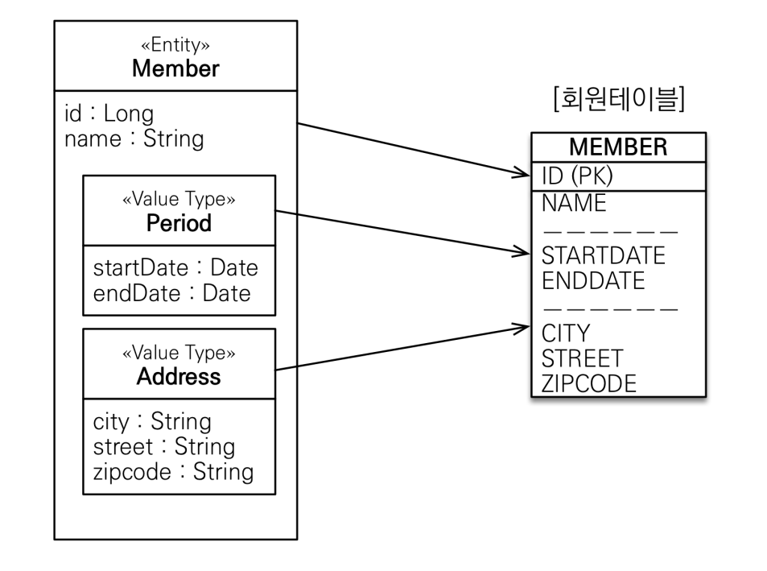

[TOC]


# Chapter 9


## embedded type (복합 값 타입)

- 새로운 값 타입을 직접 정의해서 사용할 수 있는데 JPA에서는 이것을 embedded type이라고 한다. 중요한 것은 직접 정의한 임베디드 타입도 int, String 처럼 값 타입이라는 것이다. 
- 임베디드 타입을 포함한 모든 값 타입은 엔티티의 생명주기에 의존하므로 엔티티와 임베디드 타입의 관계를 UML로 표현하면, composition 관계가 된다.
  - hibernate는 embedded type을 components라고 한다. 
- 임베디드 타입은 엔티티의 값일 뿐이다. 따라서 값이 속한 엔티티의 테이블에 매핑한다. 잘 설계한 ORM 애플리케이션은 매핑한 테이블의 수보다 클래스의 수가 더 많다. ORM을 사용하지 않고 개발하면 테이블 컬럼과 객체 필드를 대부분 1:1로 매핑한다. 



### @Embedded, @Embeddable

```java
@Entity
public class Member {
    @Embedded Address address;
    @Embedded PhoneNumber phoneNumber;
}
```


### 값 타입과 불변객체

값 타입은 복잡한 객체 세상을 조금이라도 단순화하려고 만든 개념이다. 따라서 값 타입은 단순하고 안전하게 다룰 수 있어야 한다.

문제는 임베디드 타입처럼 직접 정의한 값 타입은 자바의 primitive type이 아니라 object type이라는 것이다. 

따라서 값 타입은 될 수 있으면 불변객체(immutable object)로 설계해야 한다.


```java
@NoArgsConstructor
@Getter // @Setter를 만들지 않는다
@Embeddable
public class Address  {
    private String city;
}
```


위처럼 setter를 만들지 않으면 값을 수정할 수 없으므로 공유해도 부작용이 발생하지 않는다. 만약 값을 수정해야 한다면 새로운 객체를 생성해서 사용해야 한다. 참고로 String, Integer는 자바가 제공하는 대표적인 불변객체이다.


```java
Address address = member1.getHomeAddress();
Address newAddress = new Address(address.getCity()); //새로운 객체를 생성해서 사용
member2.setHomeAddress(newAddress); 
```


### 값 타입 컬렉션

- 값 타입을 하나 이상 저장하려면 collection에 보관하고, @ElementCollection, @CollectionTable 어노테이션을 사용하면 된다.

- 관계형 데이터베이스는 테이블 컬럼 안에 컬렉션을 포함할 수 없다. 그래서 별도의 테이블을 추가하고 `@CollectionTable`을 사용해서 추가한 테이블을 매핑해야 한다. 그리고 favoriteFoods 처럼 값으로 사용되는 컬럼이 하나면 `@Column`을 사용해서 컬럼명을 지정할 수 있다.

  

```java

@ElementCollection
@CollectionTable(name = "favorite_foods", joinColumns = @JoinColumn(name = "memer_id"))
@Column(name = "food_name")
private Set<String> favoriteFoods = new HashSet<String>();


@ElementCollection
@CollectionTable(name = "address", joinColumns = @JoinColumn(name = "member_id"))
private List<Address> addressHistory = new ArrayList<>();
    
```


값 타입 컬렉션도 조회할 때 fetch strategy를 선택할 수 있는데 LAZY가 기본이다. 

```java
@ElementCollction(fetch = FetchType.LAZY)
```


**<값타입 컬렉션의 제약사항>**

- 값 타입은 식별자라는 개념이 없고, 단순한 값들의 모음이므로 값을 변경해버리면 DB에 저장된 원본 데이터를 찾기가 어렵다. 이런 문제로 인해 **JPA 구현체들은 (하이버네이트 등) 값 타입 컬렉션에 변경사항이 발생하면, 값 타입 컬렉션이 매핑된 테이블의 연관된 테이블의 모든 데이터를 삭제하고, 현재 값 타입 컬렉션 객체에 있는 모든 값을 DB에 다시 저장한다.**
- 따라서 실무에서는 값 타입 컬렉션에 매핑된 테이블에 데이터가 많다면 값타입 컬렉션 대신에 일대다 관계를 고려해야 한다.


---

# Chapter10. 객체지향 쿼리 언어

- querydsl 사용


## fetch join

- 패치 조인을 사용하면 SQL 한번으로 연관된 엔티티들을 함께 조회할 수 있어서 SQL 호출 횟수를 줄여 성능을 최적화할 수 있다.
- 

```java
query.from(order)
    .innerJoin(order.member, member).fetch();
```


## 세타 조인

- 참고자료 : https://www.inflearn.com/questions/124696

  > 동등조인이면서 동시에 sql에서 join구문 없이 사용하는 것


## projection

- select절에 조회 대상을 지정하는 것을 의미.

```java
QItem item = QItem.item;
List<ItemDto> result = query.from(item).list(Projections.fields(ItemDto.class, item.name.as("username"), item.price));
```

Projections.fields() 를 사용하면 필드에 직접 접근해서 값을 채워준다. 필드를 private로 설정해도 동작한다.


Projection.constructor() 는 생성자를 사용하는데, 당연히 지정한 프로젝션과 파라미터 순서가 같은 생성자가 필요하다.

