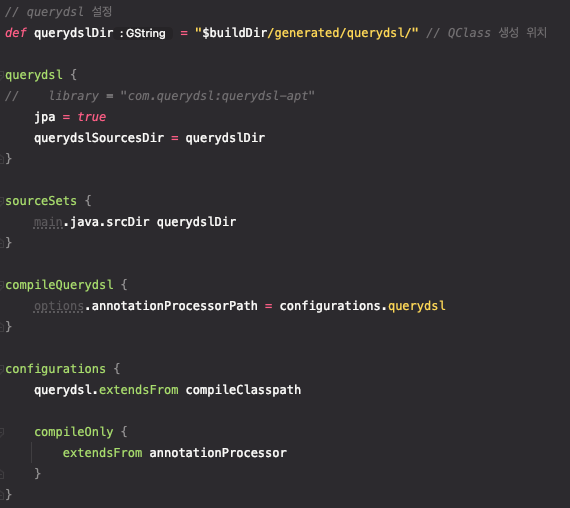

# 10.2 JPQL(Java Persistence Query Language)

<aside>
💡 특징

- JPA를 사용하면 엔티티 객체를 중심으로 개발
- 검색을 할 때도 **테이블이 아닌 엔티티 객체를 대상으로 검색**

  ⇒ 모든 DB 데이터를 객체로 변환해서 검색하는 것은 불가능

  ⇒ 애플리케이션이 필요한 데이터만 DB에서 불러오려면 결국 검색 조건이 포함된 SQL이 필요

- 테이블이 아닌 객체를 대상으로 검색하는 객체 지향 쿼리

  ⇒  SQL을 추상화해서 특정 데이터베이스 SQL에 의존X

  ⇒ JPQL을 한마디로 정의하면 객체 지향 SQL - 결국 SQL로 변환된다.

</aside>

## TypeQuery, Query

> 반환 타입을 명확히 지정할 수 있으면 TypeQuery
>
>
> ```sql
> TypedQuery<Member> query =
>       em.createQuery("SELECT m FROM Member m", Member.class);
> ```
>
> 지정할 수 없으면 Query
>
> ```sql
> Query query =
>       em.createQuery("SELECT m.username, m.age from Member m");
> ```
>

## 프로젝션

> SELECT 절에 조회할 대상을 지정하는 것
>
>
> 프로젝션 대상: 엔티티, 임베디드 타입, 스칼라 타입(숫자, 문자등 기본 데이터 타입)
>

### 엔티티 프로젝션

> 원하는 객체에 해당하는 내용만 바로 조회할 수 있다.
>
>
> **이렇게 조회한 엔티티는 영속성 컨텍스트에서 관리된다.**
>

```sql
SELECT m FROM Member m
SELECT m.team FROM Member m //회원 내 팀 엔티티 조회
```

### 임베디드 타입 프로젝션

> 엔티티와 거의 유사하게 사용되나 조회의 시작점이 될 수 없다.
>
>
> 엔티티를 통해서 조회해야 한다.
>
> 단, 이렇게 조회된 임베디드 타입은 값 타입으로 영속성 컨텍스트에서 관리되지 않는다.
>

```sql
SELECT m.address FROM Member m
```

### 스칼라 타입 프로젝션

> 숫자, 문자, 날짜와 같은 기본 데이터 타입 조회
>

```sql
SELECT m.username, m.age FROM Member m
```

### new 명령어 조회

> 의미 있는 DTO객체로 변환해서 받아주는 것
>
>
> 엔티티에서 특정 필드를 골라서 받아주면 Object[ ]로 반환 되는데 이를 DTO로 변환해주는 것
>

```sql
SELECT new jpabook.jpql.UserDTO(m.username, m.age) FROM Member m
```

> 패키지명을 포함한 전체 클래스 명 입력
>
>
> 순서와 타입이 일치하는 생성자 필요
>

### 페이징 API

> JPA는 페이징을 다음 두 API로 추상화
>
> - **setFirstResult**(int startPosition) : 조회 시작 위치 (0부터 시작)
> - **setMaxResults**(int maxResult) : 조회할 데이터 수

## 10.2.6 JPQL조인

### 세타 조인
참고 페이지 :: 
[데이터베이스,SQL 조인(join)완벽 정리](https://spidyweb.tistory.com/149)

### 페치 조인 (373p~)

> SQL에서 이야기하는 조인의 종류가 아니라 JPQL에서 제공하는 성능 최적화 기능
>
>
> 연관된 엔티티나 컬렉션을 SQL ****한 번에 조회하는 기능이다.
>

**페치 조인과 일반 조인의 차이**

> 일반 조인을 할 경우 JPQL은 결과를 반환할 때 연관관계까지 고려하지 않는다.
>
>
> 단지 SELECT절에 지정한 엔티티만 조회할 뿐이다.
>
> 반면 페치 조인을 사용하면 연관된 엔티티도 함께 조회한다.
>

**페치 조인의 특징과 한계**

- **페치 조인 대상에는 별칭을 줄 수 없다. (**하이버네이트는 가능, 가급적 사용X)
- **둘 이상의 컬렉션은 페치 조인 할 수 없다.컬렉션을 페치 조인하면 페이징 API (setFirstResult,setMaxResults)를 사용할 수 없다**
- **일대일, 다대일 같은 단일값 연관 필드들은 페치조인해도 페이징 가능**
- 하이버네이트는 경고 로그를 남기고 메모리에서 페이징(매우 위험)
- **연관된 엔티티들을 SQL 한 번으로 조회 - 성능 최적화**
- 엔티티에 직접 적용하는 글로벌 로딩 전략보다 우선함
- 실무에서 글로벌 로딩 전략은 모두 지연 로딩
- 최적화가 필요한 곳은 페치 조인 적용

# 10.4 QueryDsl

## QueryDsl 환경설정

### 환경설정

책에서 알려주는 pom.xml 설정과는 다소 차이가 있다

> aggregate - build.gradle
>
>
> 
>

<aside>
💡 참고 페이지

[QueryDSL](https://www.notion.so/QueryDSL-28cc91c134c54a9495b7a5f991e16cf4)

</aside>

