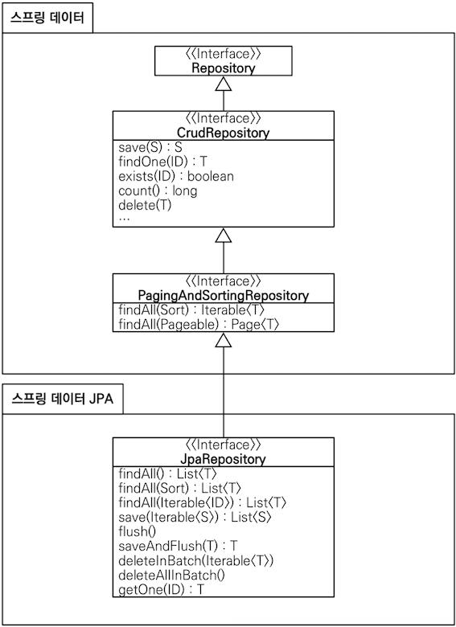
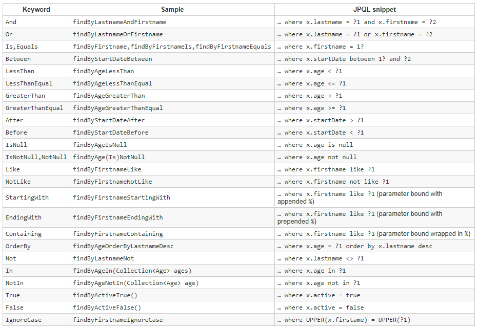
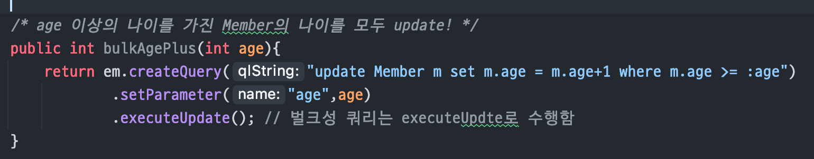
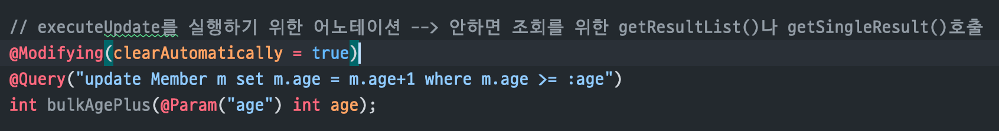

# 스프링 데이터 JPA 소개

> 스프링 데이터 JPA는 스프링 프레임워크에서 JPA를 편리하게 사용할 수 있도록 지원하는 프로젝트
>
>
> 데이터 접근 계층을 개발할 때 구현 클래스 없이 인터페이스만 작성해도 개발을 완료할 수 있다.
>
> CRUD를 처리하기 위한 공통 메소드는 스프링 데이터 JPA가 제공하는 JpaRepository 인터페이스에 있다
>
> 스프링 데이터 JPA는 메소드 이름을 분석해서 JPQL을 실행한다.
>

# 공통 인터페이스 기능
직접 정리했었던 내용 :: 
[@Repository](https://www.notion.so/Repository-786629d72057453daa6283ab93d2f06a)

## JpaRepository 인터페이스의 계층 구조

> 스프링 데이터 JPA가 제공하는 JpaRepository 인터페이스는 JPA에 특화된 기능을 제공한다.
>
>
> 
>
> 주요 메소드
>
> - `save(S)` : 새로운 엔티티는 저장하고, 이미 있는 엔티티는 수정한다.
>   - 엔티티에 식별자 값이 `null` 이면 새로운 엔티티로 판단해서 `EntityManager.persist()` 를 호출하고, 식별자 값이 있으면 이미 있는 엔티티로 판단해서 `EntityManager.merge()` 를 호출한다.
> - `delete(T)` : 엔티티 하나를 삭제한다. 내부에서 `EntityManager.remove()` 를 호출한다.
> - `findOne(ID)` : 엔티티 하나를 조회한다. 내부에서 `EntityManager.find()` 를 호출한다.
> - `getOne(ID)` : 엔티티를 프록시로 조회한다. 내부에서 `EntityManager.getReference()` 를 호출한다.
> - `findAll(...)` : 모든 엔티티를 조회한다. 정렬이나 페이징 조건을 파라미터로 넘길 수 있다.

# 쿼리 메소드 기능

> 스프링 데이터 JPA는 메소드 이름만으로 쿼리를 생성하는 기능을 제공한다.
>
> - 즉, 인터페이스에 메소드만 선언하면 해당 메소드의 이름으로 적절한 JPQL 쿼리를 생성해서 실행한다.
>
> 스프링 데이터 JPA가 제공하는 쿼리 메소드 기능은 크게 3가지가 있다.
>
> - 메소드 이름으로 쿼리 생성
> - 메소드 이름으로 JPA NamedQuery 호출
> - `@Query` 어노테이션을 사용해서 Repository interface에 쿼리 직접 정의

## 메소드 이름으로 쿼리 생성

예시

```sql
public interface MemberRepository extends Repository<Member, Long> {
  List<Member> findByEmailAndName(String email, String name);
}
```

쿼리 생성 기능을 사용하려면 정해진 규칙에 따라 메소드 이름을 지어야 한다.



## **JPA NamedQuery**

> 스프링 데이터 JPA는 메소드 이름으로 JPA Named 쿼리를 호출하는 기능을 제공한다.
>

```sql
@Entity
@NamedQuery(name="Member.findByUsername",
           query="select m from Member m where m.username = :username")
public class Member {
  ...
}
```

> 위에서 정의한 Named 쿼리를 JPA에서 직접 호출하려면 다음과 같이 작성해야 한다.
>

```sql
public class MemberRepository {
  @PersistenceContext
  EntityManager em;
  
  public List<Member> findByUsername(String username) {
    ...
    List<Member> resultList = em.createNamedQuery("Member.findByUsername", Member.class)
      .setParameter("username", username)
      .getResultList();
  }
}
```

<aside>
💡 `@PersistenceContext`

- 순수 자바 환경에서는 `EntityManagerFactory`를 이용해서 엔티티 매니저를 직접 생성해서 사용했다. 반면 스프링에서는 Spring Container가 엔티티 매니저를 관리하고 제공해준다.
- 해당 어노테이션으로 컨테이너가 관리하는 엔티티 매니저를 주입받아 사용해야 컨테이너가 제공하는 트랜잭션 기능과 연계해서 컨테이너의 다양한 기능들을 사용할 수 있다.
</aside>

> 스프링 데이터 JPA를 사용하면 메소드 이름만으로 Named 쿼리를 호출할 수 있다.
>

```sql
public interface MemberRepository extends JpaRepository<Member, Long> {
  List<Member> findByUsername(@Param("username") String username);
}
```

> 스프링 데이터 JPA는 선언한 `도메인 클래스 + . + 메소드 이름` 으로 Named 쿼리를 찾아서 실행한다.
>
> - 만약 해당하는 Named 쿼리가 없으면 메소드 이름으로 쿼리 생성 전략을 사용한다.
> - `@Param` : 이름 기반 파라미터 바인딩시에 사용하는 어노테이션

## `@Query` - Repository 메소드에 쿼리 정의

> Repository 메소드에 직접 쿼리를 정의하려면 `@Query` 어노테이션을 사용한다.
>
>
> 정적 쿼리를 직정 작성하므로 이름없는 Named쿼리라고 할 수 있다.
>
> (**Named Query :** 이름을 부여해서 재활용 할 수 있는 JPQL)
>
> [https://www.baeldung.com/hibernate-named-query#:~:text=A named query is a,in case of an error](https://www.baeldung.com/hibernate-named-query#:~:text=A%20named%20query%20is%20a,in%20case%20of%20an%20error).
>
> [Named Query](https://minkukjo.github.io/framework/2021/01/05/Spring-Data-JPA-29/)
>

```sql
public interface MemberRepository extends JpaRepository<Member, Long> {
  @Query("select m from Member m where m.username = ?1")
  Member findByUsername(String username);
}
```

> `@Query` 어노테이션의 속성으로 실행할 JPQL 쿼리를 작성한다.
>
> - 네이티브 SQL을 사용하려면 `nativeQuery = true` 를 설정한다.
> - JPQL은 위치 기반 파라미터를 1부터 시작하지만, 네이티브 SQL은 0부터 시작한다.

```sql
public interface MemberRepository extends JpaRepository<Member, Long> {
  @Query(value="SELECT * FROM MEMBER WHERE USERNAME = ?0",
        nativeQuery = true)
  Member findByUsername(String username);
}
```

MySuni예시

```sql
@Query(value = "SELECT * FROM student s " +
            "WHERE s.student_type = \'Cube\' " +
            "AND s.learning_state = \'Progress\' " +
            "AND s.sum_view_seconds > 0"
            ,nativeQuery = true)
    List<StudentJpo> findAllByStudentTypeAndLearningStateAndSumViewSecondsIsGreaterThan();
```

## @Param - 파라미터 바인딩

> 스프링 데이터 JPA는 위치 기반 파라미터 바인딩(기본값)과 이름 기반 파라미터 바인딩을 모두 지원한다.
>
>
> 이름기반을 사용하려면 `@Param`어노테이션을 사용한다.
>

```sql
public interface MemberRepository extends JpaRepository<Member, Long> {
  @Query("select m from Member m where m.username = :name")
  Member findByUsername(@Param("name") String username);
}
```

MySuni예시

```sql
@Query(value = "SELECT * FROM student s " +
            "WHERE s.student_type = :studentType " +
            "AND s.learning_state = :learningState " +
            "AND s.sum_view_seconds > 0"
            ,nativeQuery = true)
    List<StudentJpo> findAllByStudentTypeAndLearningStateAndSumViewSecondsIsGreaterThan0(@Param("studentType") StudentType studentType
                                                ,@Param("learningState") LearningState learningState);
```

## 벌크성 수정 쿼리

### 개념

> 특정한 한 데이터가 아닌 다수의 데이터를 수정하는 쿼리를 말한다
>
>
> JPA에서는 데이터 수정시 '변경감지'를 통해 값을 수정한다.
>
> ⇒ 변경 데이터가 많을 때 굳이 하나씩 '변경감지'를 일으켜서 비효율적이다
>
> 순수 JPA는 `em.createQuery(...).executeUpdate()`를 사용해서 벌크성 수정 쿼리를 사용한다
>
> 스프링 데이터 JPA에서는 이러한 벌크성 수정 쿼리를 편리하게 사용하기 위한 방법을 제공한다
>

`before`



`after`



> 스프링 데이터 JPA에서 벌크성 수정, 삭제 쿼리는 `@Modifying` 어노테이션을 사용한다.
>
>
> 벌크성 쿼리 실행 후 영속성 컨텍스트를 초기화하고 싶으면 `@Modifying(clearAutomatically = true)` 로 설정한다.
>

## 반환 타입

> 스프링 데이터 JPA는 조회 결과가 한 건 이상이면 컬렉션 인터페이스를 사용하고, 단 건이면 반환 타입을 지정한다.
>

```sql
List<Member> findByName(String name);
Member findByEmail(String email);
```

> 조회 결과가 없으면 컬렉션은 빈 컬렉션을, 단건은 `null` 을 반환한다.
>
> - 단 건 조회를 위해 반환 타입을 지정했는데 결과가 2건 이상 조회되면  `NonUniqueResultException` 예외가 발생한다.
> - 단 건으로 지정한 메소드를 호출하면 스프링 데이터 JPA는 내부적으로  `Query.getSingleResult()`  메서드를 호출한다.
    >
    >     이 때 조회 결과가 없으면 `NoResultException`예외가 발생하는데, 스프링 데이터 JPA는 이 예외를 무시하고 null을 반환한다.
>

## 페이징과 정렬

> 스프링 데이터 JPA는 쿼리 메소드에 페이징과 정렬 기능을 사용할 수 있도록 아래 2가지 파라미터를 제공한다.
>
> - `Sort` : 정렬 기능
> - `Pageable` : 페이징 기능
    >     - 반환 타입으로 `List` 나 `Page` 를 선택할 수 있다.
>     - `Page` 타입으로 반환 시 스프링 데이터 JPA는 페이징 기능을 제공하기 위해 검색된 전체 데이터 건수를 조회하는 `COUNT` 쿼리를 추가로 수행한다.
>
> ```sql
> Page<Member> findByName(String name, Pageable pageable);
> List<Member> findByName(String name, Pageable pageable);
> List<Member> findByName(String name, Sort sort);
> ```
>

### 책 예제

> 다음 조건을 만족하는 회원 조회 코드를 보자.
>
> - 검색 조건 : 이름이 김으로 시작하는 회원
> - 정렬 조건 : 이름으로 내림차순
> - 페이징 조건 : 첫번째 페이지, 페이지 당 10건의 데이터 보여준다

```sql
public interface MemberRepository extends JpaRepository<Member, Long> {
  Page<Member> findByNameStartingWith(String name, Pageable pageable);
}
```

```sql
PageRequest pageRequest = new PageRequest(0, 10, new Sort(Direction.DESC, "name"));
  
Page<Member> result = memberRepository.findByNameStartingWith("김", pageRequest);
  
List<Member> members = result.getContent();
int totalPages = result.getTotalPages();
boolean hasNextPage = result.hasNextPage();
```

> `Pageable` 은 인터페이스이므로 해당 인터페이스를 구현한 `PageRequest` 객체를 생성하여 전달한다.
>
> - `PageRequest` 생성자의 첫번째 파라미터는 현재 페이지, 두번째 파라미터는 조회할 데이터 수를 입력한다.
> - 페이지는 0부터 시작한다.

MySuni사용예 `lecture - SequenceBookStore`


## @Lock

> 쿼리 시 락을 걸려면 `@Lock` 어노테이션을 사용한다.
>

```sql
@Lock(LockModeType.PESSIMISTIC_WRITE)
List<Member> findByName(String name);
```

# 명세(**Specification**)

[Spring Data Specification](https://dahye-jeong.gitbook.io/spring/spring/2020-04-12-jpa-specification)

> **Specification는 검색조건을 추상화한 객체**다. 검색 조건에 대해 Specification에 생성하고, 이를 통해 다양한 조건의 검색을 할 수 있다는 뜻이다.
>

> Specification을 이해하기 위한 핵심 단어는 술어`Predicate` 인데, 이것은 단순히 참이나 거짓으로 평가된다.
>
> - `AND` 나 `OR` 같은 연산자로 조합할 수 있다.
> - 예를 들어, 데이터를 검색하기 위한 제약 조건 하나하나를 `Predicate` 라 할 수 있다.
>
> 이 `Predicate`를 스프링 데이터 JPA는 `Specification` 클래스로 정의했다.
>
> - `Specification` 은 COMPOSITE 패턴으로 구성되어 있어서 여러 `Specification` 을 조합할 수 있다.
    >
    >     ⇒ 따라서 여러 검색 조건을 조합해서 새로운 검색조건을 만들 수 있다.
>
>
> Specification 기능을 사용하려면 Repository에서 `JpaSpecificationExecutor` 인터페이스를 상속받으면 된다.
>

```sql
public interface OrderRepository extends JpaRepository<Order, Long>, JpaSpecificationExecutor<Order> {
}
```

> `JpaSpecificationExecutor` 의 메소드들은 `Specification` 을 파라미터로 받아서 검색 조건으로 사용한다.
>

```sql
import static org.springframework.data.jpa.domain.Specifications.*; // where()

public List<Order> findOrders(String name) {
  List<Order> result = orderRepository.findAll(
  where(memberName(name)).and(isOrderStatus())
  );
  
  return result;
}
```

> Specifications는 명세들을 조립할 수 있도록 도와주는 클래스인데, `where()`, `and()`, `or()`, `not()` 메소드를 제공한다.
>
>
> `findAll()` 메소드에 회원 이름 명세(`memberName`)와 주문 상태 명세(`isOrderStatus`)를 `and` 로 조합해서 검색 조건 파라미터로 넘겨주었다.
>

### 명세 정의

> 명세를 정의하려면 `Specification` 인터페이스를 구현하면 된다.
>
>
> 인터페이스 구현시에 `toPredicate()` 메서드만 구현하면 되는데 파라미터로 주어지는  `Root` , `CriteriaQuery` , `CriteriaBuilder` 를 활용해서 적절한 검색 조건을 반환하면 된다.
>

```sql
public class OrderSpec {
  
  public static Specification<Order> memberName(final String memberName) {
    return new Specification<Order>() {
      public Predicate toPredicate(Root<Order> root, CriteriaQuery<?> Query, CriteriaBuilder builder) {
        
        if(StringUtils.isEmpty(memberName)) return null;
        
        Join<Order, Member> m = root.join("member", JoinType.INNER);
        return builder.equal(m.get("name"), memberName);
      }
    };
  }
  
  public static Specification<Order> isOrderStatus() {
    return new Specification<Order>() {
      public Predicate toPredicate(Root<Order> root, CriteriaQuery<?> Query, CriteriaBuilder builder) {
        
        return builder.equal(root.get("status"), OrderStatus.ORDER);
      }
    }
  }
}
```

# 사용자 정의 리포지토리 구현

> Repository를 직접 구현하면 공통 인터페이스가 제공하는 기능까지 모두 구현해야 한다.
>
>
> 스프링 데이터 JPA는 이런 문제를 우회해 필요한 메소드만 구현할 수 있는 방법을 제공한다.
>
> 사용자가 직접 Repository의 메소드를 구현하여야 할 때 사용자 정의 인터페이스를 생성한 뒤 해당 인터페이스를 구현하는 클래스를 작성해야 한다.
>

```sql
public interface MemberRepositoryCustom {
  public List<Member> findMemberCustom();
}
```

> 사용자 정의 인터페이스를 구현하는 클래스는 이름을 짓는 규칙이 있는데, `Repository 인터페이스 이름 + Impl` 로 지어야한다.
>
> - 규칙에 맞게 이름을 지어야 스프링 데이터 JPA가 사용자 정의 구현 클래스로 인식한다.

```sql
public class MemberRepositoryImpl implements MemberRepositoryCustom {
  @Override
  public List<Member> findMemberCustom() {
    // 사용자 정의 구현
    ...
  }
}
```