<aside>
💡 이번 장에서 중요한 것

- 다중성
    - 다대일(@ManyToOne)
    - 일대다(@OneToMany)
    - 일대일(@OneToOne)
    - 다대다(@ManyToMany)
- 방향
    - 단방향
    - 양방향
- 연관관계의 주인
</aside>

# 6.1 다대일

> DB의 1 : N 관계에서 외래 키는 항상 N쪽에 있다.
>

## 6.1.1 다대일 단방향 [N : 1]

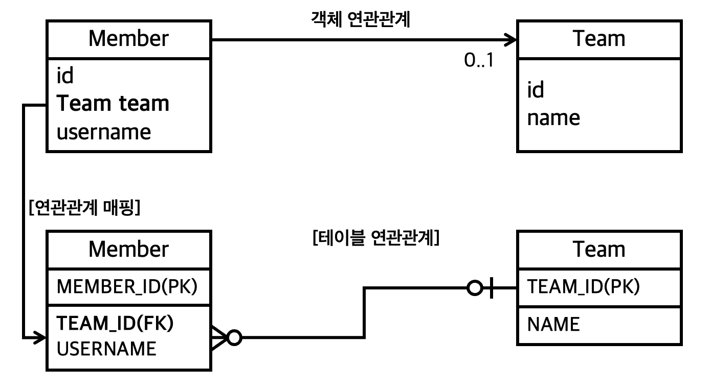

*`@JoinColumn`*을 사용해서 [Member.team](http://Member.team) 필드를 `TEAM_ID`와 매핑함

```sql
//연관관계 매핑
@ManyToOne
@JoinColumn(name = "TEAM_ID")
private Team team;
```

## 6.1.2 다대일 양방향 [N:1, 1:N]

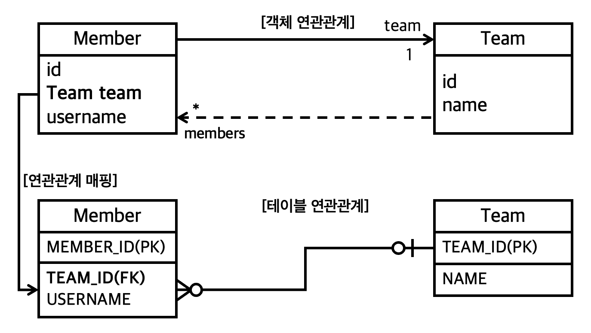

### Member

```java
@Getter
@Setter
@NoArgsConstructor
@AllArgsConstructor
@Entity
public class Member {
    //
    @Id
    @GeneratedValue
    @Column(name = "MEMBER_ID")
    private long id;

    private String username;

    //연관관계 매핑
    @ManyToOne
    @JoinColumn(name = "TEAM_ID")
    private Team team;

    //setter수정
    public void setTeam(Team team) {
        //
        this.team = team;

        //무한루프 방지
        if (!team.getMembers().contains(this)) {
            team.getMembers().add(this);
        }
    }
}
```

### Team

```java
@Getter
@Setter
@Entity
@NoArgsConstructor
@AllArgsConstructor
public class Team {
    //
    @Id
    @Column(name = "TEAM_ID")
    private Long id;

    private String name;

    @OneToMany(mappedBy = "team")
    private List<Member> members = new ArrayList<>();

    public void addMember (Member member) {
        //
        this.members.add(member);
        if (member.getTeam() != this) { //무한루프 방지
            member.setTeam(this);
        }
    }
}
```

> Point
>
> - **양방향은 외래 키가 있는 쪽이 연관관계의 주인이다.**
    >
    >     주인이 아닌 쪽은 JPQL, 객체 그래프 탐색시에 사용한다.
>
> - **양방향 연관관계는 항상 서로를 참조해야한다.**
    >
    >     단, 무한루프 방지 메소드를 작성해주어야 한다. (ex `setTeam`, `addMember`)
>

# 6.2 일대다

> 엔티티를 하나 이상 참조할 수 있다 → 자바 컬렉션을 사용해야한다.
>

## 6.2.1 일대다 단방향 [1:N]

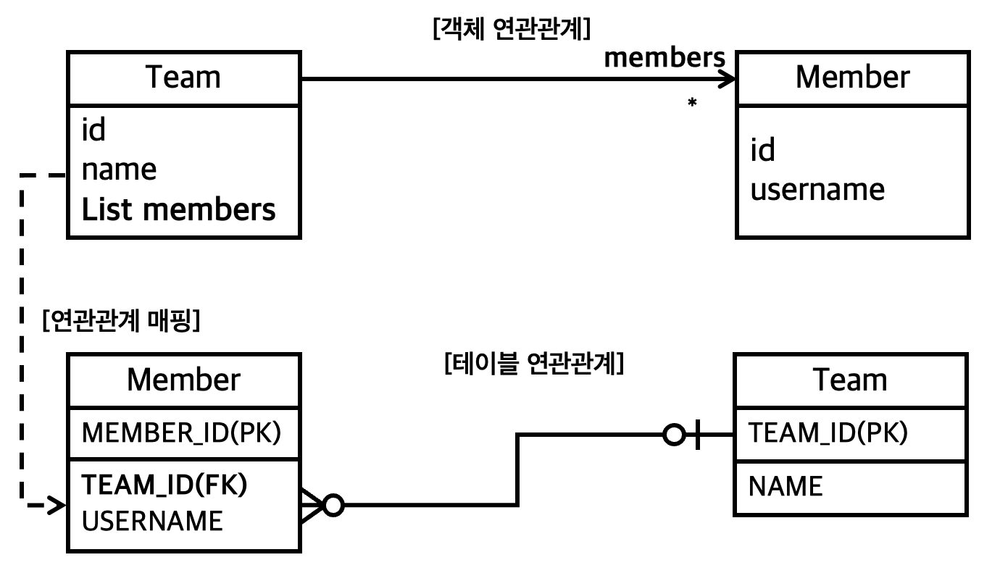

> 일대다 단방향 관계는 약간 특이하다
>
>
> 외래 키는 항상 다쪽 테이블에 있다
>
> 하지만 다 쪽인 Member 엔티티에는 외래 키를 매핑할 수 있는 참조 필드가 없다.
>

### *`Member`*

```java
@Getter
@Setter
@NoArgsConstructor
@AllArgsConstructor
@Entity
public class Member {
    //
    @Id
    @GeneratedValue
    @Column(name = "MEMBER_ID")
    private long id;

    private String username;
```

### *`Team`*

```java
@Getter
@Setter
@Entity
@NoArgsConstructor
@AllArgsConstructor
public class Team {
    //
    @Id
		@GeneratedValue
    @Column(name = "TEAM_ID")
    private Long id;

    private String name;

    @OneToMany
    @JoinColumn(name = "TEAM_ID") // Member테이블의 TEAM_ID(FK)
    private List<Member> members = new ArrayList<>();
```

> 일대다 단방향 관계를 매핑할 때는 *`@JoinColumn`*을 명시해야한다.
>
>
> 그렇지 않으면 JPA는 연결 테이블을 중간에 두고 연관관계를 관리하는 조인테이블 전략을 기본으로 사용해서 매핑한다.
>

### 일대다 단방향 매핑의 단점

> 매핑한 객체가 관리하는 외래 키가 다른 테이블에 있다.
>
>
> 빨간 줄의 부분에서 보이는 것 처럼 본인 테이블에 외래 키가 있으면 저장과 연관관계 처리를 insert한번에 끝낼 수 있지만, 다른 테이블에 있기 때문에 update가 한 번 더 되어야 한다.
>

```java
public static void testSave(EntityManager em) {
    //
    Member member1 = new Member("member1");
    Member member2 = new Member("member2");

    Team team1 = new Team("team1");
    team1.getMembers().add(member1);
    team1.getMembers().add(member2);

    em.persist(member1);
    em.persist(member2);
    em.persist(team1);
}
```

실행 쿼리

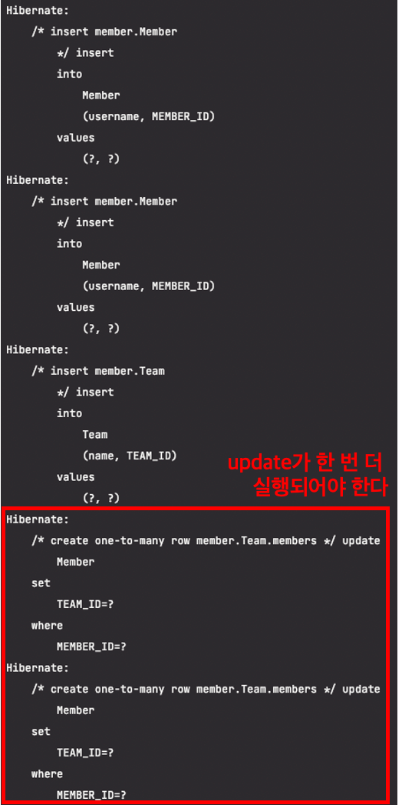

<aside>
💡 ⇒ 성능, 관리문제가 있으니 다대일 양방향 매핑을 사용하자

</aside>

## 6.2.2 일대다 양방향 [1:N, N:1]  - 이론만 정리

> 외래 키는 항상 다 쪽에 있다
>
>
> 하지만 일 쪽에도 외래 키를 추가할 수는 있다.
>
> @OneToMany쪽에 @JoinColumn을 추가한 다음, @ManyToOne의 @JoinColumn에는 읽기 전용 옵션만 붙이는 식
>
> ```java
> @ManyToOne
> @JoinColumn(name = "TEAM_ID", insertable = false,
>         updatable = false)
> private Team team;
> ```
>
> (둘 다 외래 키를 관리하는 문제를 해결하기 위해)
>

# 6.3 일대일 [1:1]

<aside>
💡 특징

- 일대일 관계는 그 반대도 일대일
- 일대일 관계는 주 테이블이나 대상 테이블 둘 중 어느 곳이나 외래 키를 가질 수 있다.

  ⇒ 일대일 관계는 주 테이블이나 대상 테이블 중에 누가 외래키를 가질지 선택해야 한다.

    - 주 테이블에 외래 키

      주 테이블만 확인해도 대상 테이블과 연관관계가 있는지 알 수 있다.

    - 대상 테이블에 외래 키

      일대일 → 일대다 변경 시 테이블 구조를 그대로 유지할 수 있다.

</aside>

## 6.3.1 주 테이블에 외래 키

### 단방향

> 다대일 단방향과 유사
>

*`Member`*

```java
@Getter
@Setter
@NoArgsConstructor
@AllArgsConstructor
@Entity
public class Member {
    //
    @Id
    @GeneratedValue
    @Column(name = "MEMBER_ID")
    private long id;

    private String username;

    @OneToOne
    @JoinColumn(name = "LOCKER_ID")
    private Locker locker;
```

*`Locker`*

```java
@Getter
@Setter
@Entity
@NoArgsConstructor
@AllArgsConstructor
public classLocker{
//
@Id
    @GeneratedValue
    @Column(name = "LOCKER_ID")
privateLongid;

privateStringname;
}
```

테이블 생성 쿼리

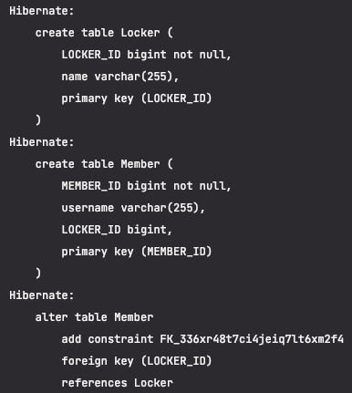

### 양방향

> locker에서 member를 매핑하도록 변경
>
>
> 양방향이므로 연관관계의 주인을 정해야 한다. Member테이블이 외래 키를 가지고 있으므로 `Member.locker`가 연관관계의 주인이다.
>
> 반대편의 `Locker.member`는 `mappedBy`를 선언해서 연관관계의 주인이 아니라고 설정했다.
>

*`Locker`*

```java
@Getter
@Setter
@Entity
@NoArgsConstructor
@AllArgsConstructor
public class Locker {
    //
    @Id
    @GeneratedValue
    @Column(name = "LOCKER_ID")
    private Long id;

    private String name;

    @OneToOne(mappedBy = "locker")
    private Member member;
}
```

## 6.3.2 대상 테이블에 외래 키

### 단방향

> 대상 테이블에 외래 키가 있는 단방향 관계는 JPA에서 지원하지 않는다.
>

### 양방향

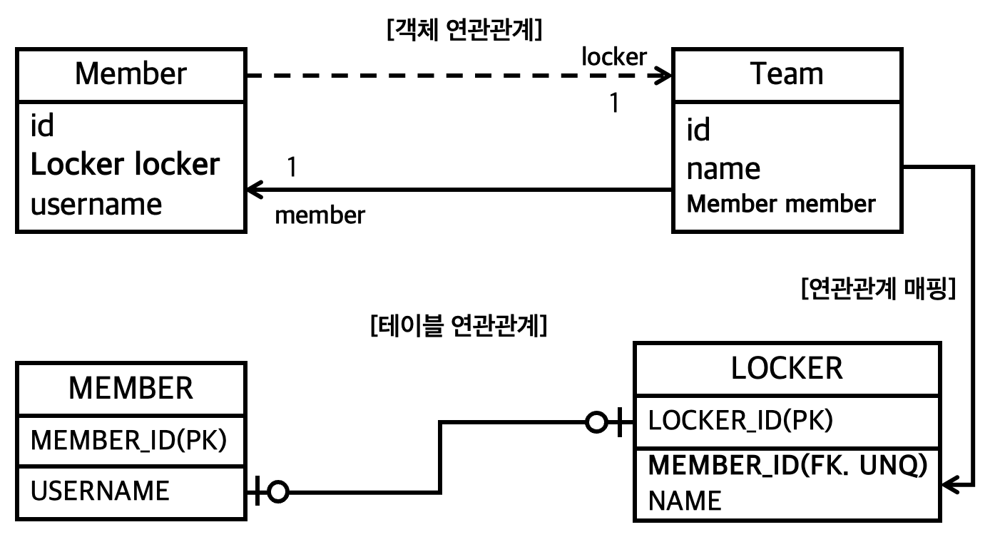

*`Member`*

```java
@Getter
@Setter
@NoArgsConstructor
@AllArgsConstructor
@Entity
public class Member {
    //
    @Id
    @GeneratedValue
    @Column(name = "MEMBER_ID")
    private long id;

    private String username;

    @OneToOne(mappedBy = "member")
    private Locker locker;
```

*`Locker`*

```java
@Getter
@Setter
@Entity
@NoArgsConstructor
@AllArgsConstructor
public class Locker {
    //
    @Id
    @GeneratedValue
    @Column(name = "LOCKER_ID")
    private Long id;

    private String name;

    @OneToOne
    @JoinColumn(name = "MEMBER_ID")
    private Member member;
}
```

생성 쿼리

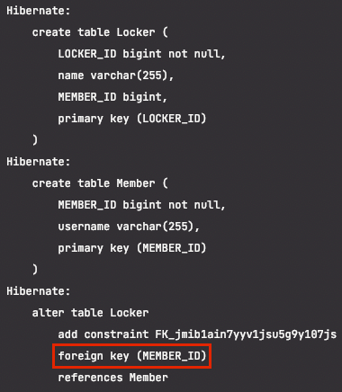

# 6.4 다대다 [N:N]

> 다대다 관계를 테이블로 표현 할 때 정규화된 테이블 2개로 표현할 수 없다. → 연결 테이블이 필요함
>
>
> 하지만 객체는 2개로 묘사할 수 있고 이러한 객체를 `@ManyToMany`로 매핑할 수 있다
>

## 6.4.1 단방향

### 엔티티 설계

*`Member`*

```java
@Entity
public class Member {
    //
    @Id
    @Column(name = "MEMBER_ID")
    private String id;

    private String username;

    @ManyToMany
    @JoinTable(name = "MEMBER_PRODUCT",
    joinColumns = @JoinColumn(name = "MEMBER_ID"),
    inverseJoinColumns = @JoinColumn(name = "PRODUCT_ID"))
    private List<Product> product = new ArrayList<>();
```

*`Product`*

```java
@Entity
public class Product {
    //
    @Id
    @Column(name = "PRODUCT_ID")
    private String id;

    private String name;
```

생성 쿼리

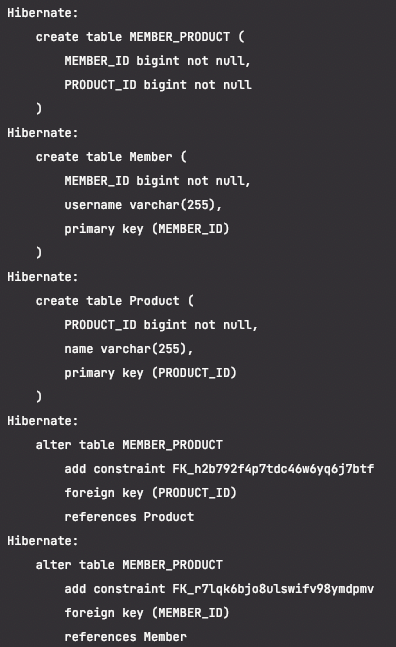 

### *`@JoinTable`* 속성

- name : 연결 테이블을 지정
- joinColumns : 현재 방향인 회원과 매핑할 조인 컬럼 정보를 저장
- inverseJoinColumns : 반대 방향인 상품과 매핑할 조인 컬럼 정보를 지정

### save 로직

```java
public static void testSave(EntityManager em) {
    //
    Product productA = new Product();
    productA.setId("product1");
    productA.setName("상품A");
    em.persist(productA);

    Member member1 = new Member("회원1");
    member1.setId("member1");
    member1.getProduct().add(productA);
    em.persist(member1);
}
```

생성 쿼리

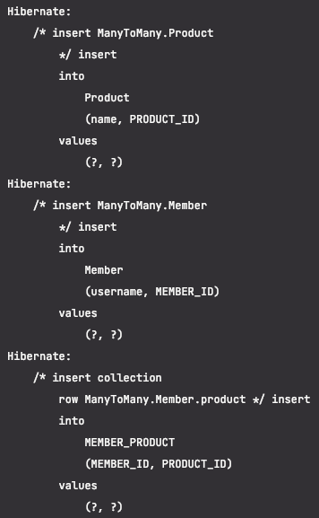

### find 로직

```java
public static void find(EntityManager em) {
    //
    Member member = em.find(Member.class, "member1");
    List<Product> products = member.getProduct();
    for (Product product : products) {
        System.out.println("Product name ::: " + product.getName());
    }
}
```

find결과


## 6.4.2 양방향

> 다대다 매핑이므로 역방향도 `@ManyToMany`를 사용한다. + mappedBy로 연관관계의 주인을 설정
>

### 엔티티

*`Product`*

```java
public class Product {
    //
    @Id
    @Column(name = "PRODUCT_ID")
    private String id;
    private String name;

    @ManyToMany(mappedBy = "products")
    private List<Member> member;
}
```

### 객체 그래프 탐색

> 양방향 연관관계를 만들었으므로 역방향으로 객체그래프를 탐색할 수 있다.
>

```java
public static void findInverse(EntityManager em){
    //
    Product product = em.find(Product.class, "product1");
    List<Member> members = product.getMembers();
    for (Member member : members) {
        System.out.println("member = " + member.getUsername());
    }
}
```

## 6.4.3 다대다 매핑의 한계와 극복, 연결 엔티티 사용

> `@ManyToMany`를 사용하면 연결 테이블을 자동으로 처리해주므로 도메인 모델이 단순해져 편리
>
>
> 하지만 실무에서 사용하기에는 한계가 있는데, 연결 테이블에 컬럼을 추가할 경우 다른 엔티티에는 추가한 컬럼들을 매핑할 수 없기 때문
>

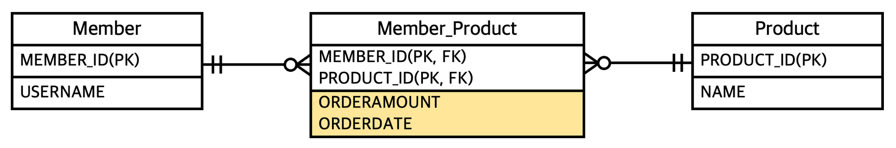

> 이를 해결하기 위해 결국 연결 엔티티를 만들고 해당 엔티티를 중심으로 다대인, 일대다 관계로 풀어내야 한다.
>

### 엔티티

*`Member`*

> 회원과 회원_상품은 양방향
>
>
> 회원_상품 쪽이 외래 키를 가지고 있으므로 연관관계의 주인
>

```java
public class Member {
    //
    @Id
    @Column(name = "MEMBER_ID")
    private String id;

    //역방향
    @OneToMany(mappedBy = "member")
    private List<MemberProduct> memberProducts;
}
```

*`Product`*

> 상품 에서 회원_상품을 탐색할 필요가 없으므로 연관관계 없음
>

```java
public class Product {
    //
    @Id
    @Column(name = "PRODUCT_ID")
    private String id;

    private String name;
}
```

*`MemberProduct`*

> @Id와 @JoinColumn을 동시에 사용해서 기본 키 + 외래 키를 한번에 매핑
>
>
> @IdClass를 사용해서 복합 기본키를 매핑
>

```java
@Entity
@IdClass(MemberProductId.class)
public class MemberProduct {
    //
    @Id
    @ManyToOne
    @JoinColumn(name = "MEMBER_ID")
    private Member member; //MemberProductId.member와 연결

    @Id
    @ManyToOne
    @JoinColumn(name = "PRODUCT_ID")
    private Product product; //MemberProductId.product와 연결

    private int orderAmount;
}
```

*`MemberProductId`*

```java
public class MemberProductId implements Serializable {
    //
    private String member; //MemberProduct.member 와 연결
    private String product; //MemberProduct.product 와 연결

}
```

### 복합 기본 키

> 회원 상품 엔티티는 기본 키가 MEMBER_ID와 PRODUCT_ID로 이루어진 복합 키이다.
>
>
> 이렇게 사용하려면 별도의 식별자 클래스를 만들어야 한다. ⇒ 여기서는 *`MemberProductId`*
>

식별자 클래스의 특징

- 복합 키는 별도의 식별자 클래스로 만들어야 한다.
- Serializable을 구현해야 한다.
- equals와 hashCode메소드를 구현해야 한다. - 대부분 자바 IDE에는 자동 생성기능이 있음
- 기본 생성자가 있어야 한다.
- 식별자 클래스는 public
- `@IdClass` 외에는 `@EmbeddidId`를 사용하는 방법도 있다

<aside>
➡️ 같이 보기

[복합키](https://www.notion.so/861c56e896e94c0ca19d9a054cab0ec2)

</aside>

### 식별 관계

> 부모 테이블의 기본 키를 받아서 자신의 기본 키 + 외래 키로 사용하는 것을 식별 관계(Identifying Relationship) 이라 한다.
>
>
> ⇒ MemberProduct는 MemberProductId 식별자 클래스로 두 기본 키를 묶어서 자신의 키 - 복합 기본 키로 사용한다.
>

### 테이블 생성 쿼리

MemberProduct에서 양쪽의 FK를 가지고 있다

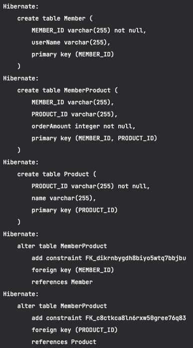

### save 코드

```java
public static void testSave(EntityManager em) {
    //회원 저장
    Member member1 = new Member();
    member1.setId("member1");
    member1.setUserName("회원1");
    em.persist(member1);

    //상품 저장
    Product productA = new Product();
    productA.setId("productA");
    productA.setName("상품A");
    em.persist(productA);

    //회원상품 저장
    MemberProduct memberProduct = new MemberProduct();
    memberProduct.setMember(member1);
    memberProduct.setProduct(productA);
    memberProduct.setOrderAmount(2);
    em.persist(memberProduct);
}
```

출력 쿼리


### find 코드

> 복합 키는 항상 식별자 클래스를 만들어서 조회해야 한다.
>
>
> ⇒ 복잡함
>

```java
public static void testFind(EntityManager em) {
    //기본 키 값 생성
    MemberProductId memberProductId = new MemberProductId();
    memberProductId.setMember("member1");
    memberProductId.setProduct("productA");

    MemberProduct memberProduct = em.find(MemberProduct.class,
            memberProductId);

    Member member = memberProduct.getMember();
    Product product = memberProduct.getProduct();

    System.out.println("member :::: " + member.getUserName());
    System.out.println("product :::: " + product.getName());
    System.out.println("orderAmount :::: " + memberProduct.getOrderAmount());

}
```

출력 결과

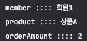

## 6.4.4 다대다 : 새로운 기본 키 적용

> DB에서 자동으로 생성해주는 대리 키를 Long 값으로 사용하는 것
>
>
> ⇒ ORM매핑시 복합 키를 만들지 않아도 되므로 간단히 완성 가능
>

Order로 이름 변경 - 새로운 기본키 적용

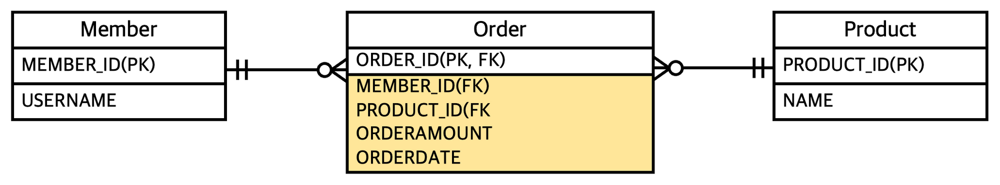

*`Orders`*

> DB에러 때문에 Orders로 명칭을 바꿔야 했다
>

```java
@Entity
public class Orders {
    //
    @Id
    @GeneratedValue
    @Column(name = "ORDERS_ID")
    private Long id;

    @ManyToOne
    @JoinColumn(name = "MEMBER_ID")
    private Member member;

    @ManyToOne
    @JoinColumn(name = "PRODUCT_ID")
    private Product product;

    private int orderAmount;
}
```

그외 엔티티, 저장 코드는 동일

### find 코드

> 식별자 클래스를 사용하지 않아 코드가 훨씬 간결해졌다
>

```java
public static void testFind(EntityManager em) {
    //
    Long ordersId = 1L;
    Orders orders = em.find(Orders.class, ordersId);

    Member member = orders.getMember();
    Product product = orders.getProduct();

    System.out.println("member :::: " + member.getUserName());
    System.out.println("product :::: " + product.getName());
    System.out.println("orderAmount :::: " + orders.getOrderAmount());
}
```

## 6.4.5 다대다 연관관계 정리

- **식별 관계** : 받아온 식별자를 기본 키 + 외래 키로 사용
- **비식별 관계** : 받아온 식별자를 외래 키로만 사용하고 새로운 식별자 추가