<aside>
💡 개요

- 상속 관계 매핑 : 객체의 상속 관계를 DB에 어떻게 매핑할 것인지
- @MappedSuperclass : 여러 엔티티에서 공통으로 사용하는 매핑 정보만 상속받고 싶으면 이 기능을 사용
- 복합 키와 식별 관계 매핑 : DB의 식별자가 하나 이상일 때 매핑하는 방법, DB설계에서 이야기하는 식별 관계와 비식별 관계
- 조인 테이블 : 테이블은 외래 키 하나로 연관관계를 맺을 수 있지만 연관관계를 관리하는 연결 테이블을 두는 방법도 있다. → 연결 테이블을 매핑하는 방법을 다룰 것
- 엔티티 하나에 여러 테이블 매핑
</aside>

# 7.1 상속 관계 매핑

> ORM에는 상속이라는 개념이 없다 - 슈퍼타입 서브타입 관계라는 모델링 기법이 유사한 개념
>
>
> ⇒ ORM의 상속은 **객체의 상속 구조와 DB의 슈퍼타입 서브타입 관계를 매핑하는 것이다.**
>

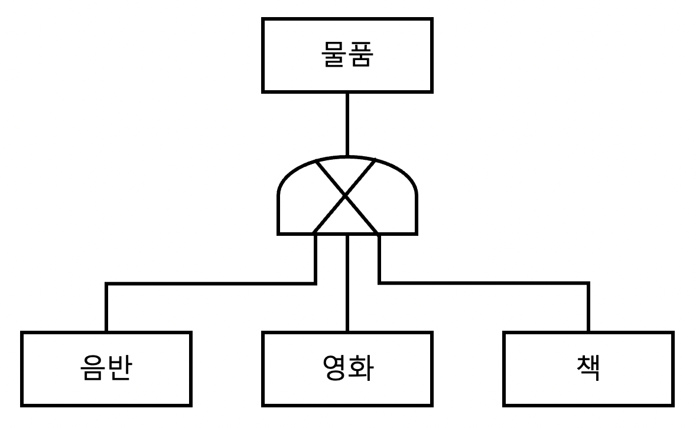

슈퍼타입 서브타입 논리 모델

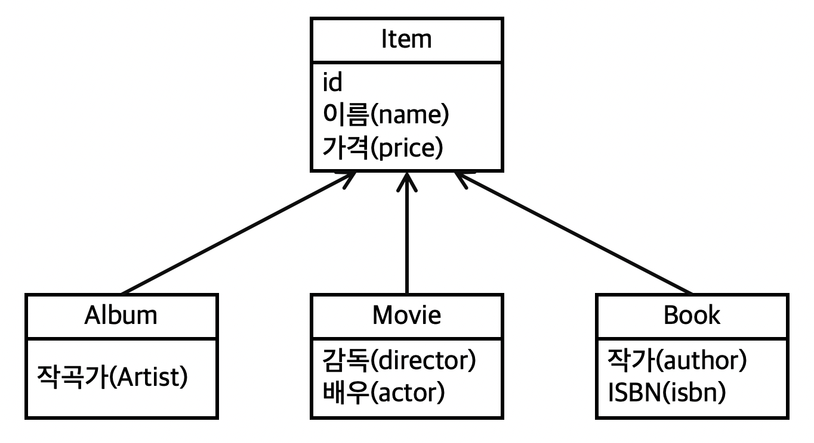

객체 상속 모델

슈퍼타입 서브타입 논리 모델 → 테이블로 구현 할 때는 아래 세가지 방법을 선택할 수 있다.

## 7.1.1 조인 전략

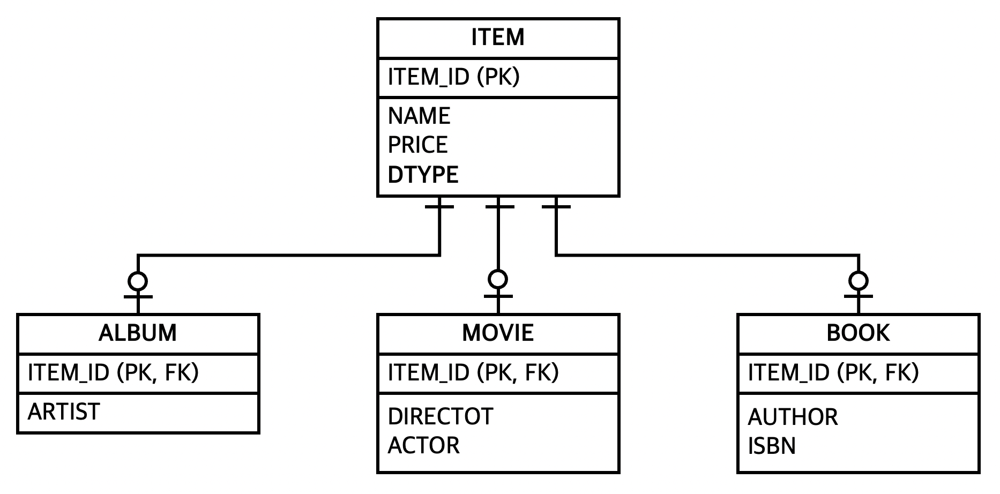

> 조인 전략은 **엔티티 각각을 모두 테이블로 만들고** 자식 테이블이 부모 테이블의 기본 키를 받아서 기본 키 + 외래 키로 사용하는 전략이다.
>
>
> 단, 객체는 타입으로 구분할 수 있지만 테이블은 타입의 개념이 없기 때문에 타입을 구분하는 컬럼(DTYPE)을 추가해야 한다.
>

### 예제 코드 분석

`*Item*`

```java
@Getter
@Setter
@Entity
@Inheritance(strategy = InheritanceType.JOINED)
@DiscriminatorColumn(name = "DTYPE")
public abstract class Item {

    @Id @GeneratedValue
    @Column(name = "ITEM_ID")
    private Long id;

    private String name;        //이름
    private int price;          //가격
```

*`Album`*

```java
@Getter
@Setter
@Entity
@DiscriminatorValue("A")
public class Album extends Item {

    private String artist;
```

*`Movie`*

```java
@Getter
@Setter
@Entity
@DiscriminatorValue("M")
public class Movie extends Item {

    private String director;
    private String actor;
```

<aside>
💡 매핑 정보 분석

1. *`@Inheritance*(strategy = *InheritanceType*.JOINED)` : 상속 매핑은 부모 클래스에 *`@Inheritance`*를 사용해야 한다. 그리고 매핑 전략을 지정해야 하는데 여기서는 조인 전략을 사용했다
2. *`@DiscriminatorColumn*(name = "DTYPE")` : 부모 클래스에 구분 컬럼을 지정한다. 이 컬럼으로 저장된 자식 테이블을 구분할 수 있다. 기본 값이 DTYPE이므로 생략할 수 있다.
3. *`@DiscriminatorValue*("M")` : 구분 컬럼에 입력할 값을 지정
</aside>

> 기본값으로 자식 테이블은 부모 테이블의 ID 컬럼명을 그대로 사용하는데, 이를 변경하고 싶으면 *`@PrimaryKeyJoinColumn`*를 사용한다.
>
>
> BOOK 테이블의 `ITEM_ID` 기본 키 컬럼명을 `BOOK_ID`로 변경
>
> ```java
> @Getter
> @Setter
> @Entity
> @DiscriminatorValue("M")
> @PrimaryKeyJoinColumn(name = "BOOK_ID")
> public class Movie extends Item {
> 
>     private String director;
>     private String actor;
> ```
>

### 테스트용 저장 코드

```java
public static void saveAlbum(EntityManager em) {
    //
    Album album1 = new Album("Artist", "ETC");
    em.persist(album1);
}
```

실행 쿼리


Item테이블, Album 테이블에 하나씩 두 번의 Insert가 실행된다.

### 장단점 및 특징

- 장점
    - 테이블 정규화
    - 외래 키 참조 무결성 제약조건 활용 가능
    - 저장공간을 효율적으로 사용 가능
- 단점
    - 조회할 때 조인이 많이 됨 → 성능 저하
    - 조회 쿼리 복잡
    - 데이터 등록시 INSERT SQL이 두 번 실행됨
- 특징
    - JPA표준 명세는 구분 컬럼을 사용토록 하지만 하이버네이트를 포함한 몇몇 구현체는 구분 컬럼(*`@DiscriminatorValue`*) 없이도 동작한다.

## 7.1.2 단일 테이블 전략

> 테이블 하나만 사용 - DTYPE으로 어떤 자식 데이터가 저장되었는지 구분
>
>
> ⇒ 일반적으로 가장 빠르다
>
> 주의점 :: 자식 엔티티가 매핑한 컬럼 모두 null을 허용해야 한다 - 한 테이블을 저장하면 다른 테이블은 null로 저장해야하기 때문
>

```java
@Getter
@Setter
@Entity
@Inheritance(strategy = InheritanceType.SINGLE_TABLE)
@DiscriminatorColumn(name = "DTYPE")
public abstract class Item {
		//
		...
}
//내부 클래스로 지정
@Entity
@DiscriminatorValue("A")
public class Album extends Item {
    //
    ...
}
```

*`@Inheritance*(strategy = *InheritanceType*.SINGLE_TABLE)`로 지정하면 단일 테이블 전략을 사용한다. 테이블 하나에 모든 것을 통합하므로 *`@DiscriminatorValue`*는 필수가 된다.

### 장단점 및 특징

- 장점
    - 조인이 필요 없으므로 일반적으로 조회 성능이 빠르다
    - 조회 쿼리가 단순하다
- 단점
    - 자식 엔티티가 매핑한 컬럼은 모두 null을 허용해야 한다.
    - 단일 테이블에 모든 것을 저장 → 테이블이 커질 수 있다.

      **⇒ 상황에 따라 조회성능이 오히려 더 늦어질 수도 있다.**

- 특징
    - 구분 컬럼을 꼭 사용해야 한다. → *`@DiscriminatorValue`* 필수
    - *`@DiscriminatorValue`*를 따로 지정하지 않으면 기본으로 엔티티 이름을 사용한다.

## 7.1.3 구현 클래스마다 테이블 전략

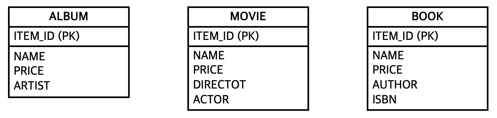

> 자식 엔티티마다 테이블 작성 - 자식 테이블 각각에 필요한 컬럼이 모두 존재
>

```java
@Getter
@Setter
@Entity
@Inheritance(strategy = InheritanceType.TABLE_PER_CLASS)
@DiscriminatorColumn(name = "DTYPE")
public abstract class Item {
```

*`@Inheritance*(strategy = *InheritanceType*.TABLE_PER_CLASS)`를 선택하면 구현 클래스마다 테이블 전략을 사용한다. 이는 자식 엔티티마다 테이블을 만든다. ⇒ **비추천**

### 장단점 및 특징

- 장점
    - 서브 타입을 구분해서 처리할 때 효과적
    - not null을 사용할 수 있다.
- 단점
    - 여러 자식 테이블을 함께 조회할 때 성능이 느리다
    - 자식 테이블을 통합해서 쿼리하기 어렵다
- 특징
    - 구분 컬럼을 사용하지 않음

# 7.2 @MappedSuperclass

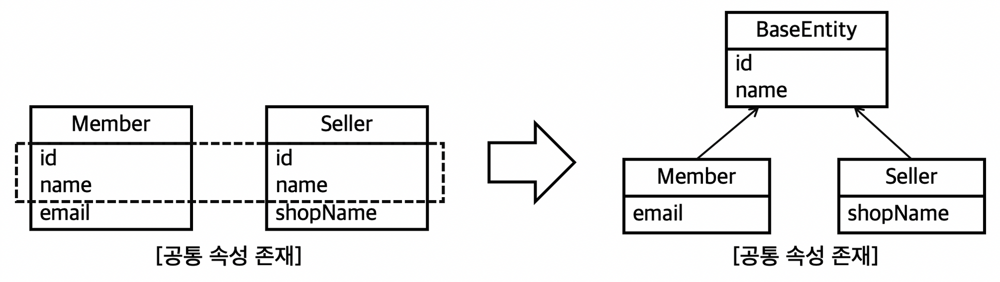

> 지금까지는 부모, 자식 클래스 모두 DB 테이블과 매핑
>
>
> 부모 클래스는 테이블과 매핑하지 않고 부모를 상속받는 자식 클래스에게 매핑 정보만 제공하고 싶으면  `@MappedSuperclass`를 사용한다.
>
> `@MappedSuperclass`는 추상클래스와 비슷한데 `@Entity`는 실제 테이블에 매핑 되지만 `@MappedSuperclass`는 매핑되지 않고 매핑 정보를 상속할 목적으로 사용된다.
>

## 회사 코드 예제

> 회사 코드에서는 `DramaEntityJpo`, `DomainEntityJpo`가 여기에 해당되었다.
>
>
> 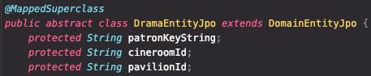
>
> 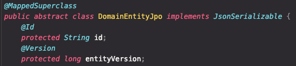
>

<aside>
💡 `DramaEntityJpo`, `DomainEntityJpo`는 테이블과 직접 매핑할 필요가 없고 자식 엔티티에게 공통으로 매핑 정보만 제공하면 된다.

자식 엔티티가 부모로 부터 물려받은

- 매핑 정보를 재정의 하려면 `@AttributeOverrides`나 `@AttributeOverride`를 사용
- 연관관계를 재정의 하려면 `@AssociationOverrides`나 `@AssociationOverride`를 사용
</aside>

### `@AttributeOverrides` 예제 코드

> 부모에게 상속받은 id속성의 컬럼명 재정의
>

```java
@Entity
@AttributeOverrides({
        @AttributeOverride(name = "id", column = @Column(name = "MEMBER_ID")),
        @AttributeOverride(name = "name", column = @Column(name = "MEMBER_NAME"))
})
public class Member extends BaseEntity {
```

## `@MappedSuperclass`의 특징

- 테이블과 매핑되지 않고 자식 클래스에 엔티티의 매핑 정보를 상속하기 위해 사용
- `@MappedSuperclass`로 지정한 클래스는 엔티티가 아니므로 em.find()나 JPQL에서 사용할 수가 없다.
- 이 클래스를 직접 생성해서 사용할 일은 거의 없음 → 추상 클래스로 만들 것

# 7.3 복합 키와 식별 관계 매핑

## 7.3.1 식별 관계 vs 비식별 관계

> 테이블 사이에 관계는 외래 키가 기본 키에 포함되는지 여부에 따라 식별 관계와 비식별 관계로 구분한다
>
>
> 화살표 모양 주목
>

### 식별 관계

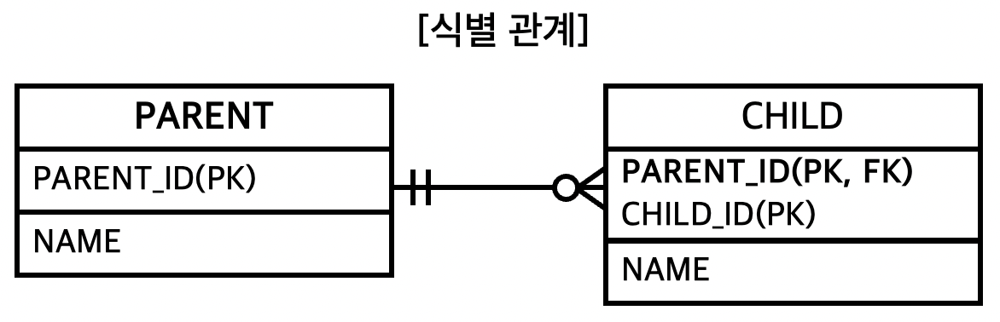

> 부모 테이블의 기본 키를 내려받아서 자식 테이블의 기본 키 + 외래 키로 사용하는 관계
>

### 비식별 관계

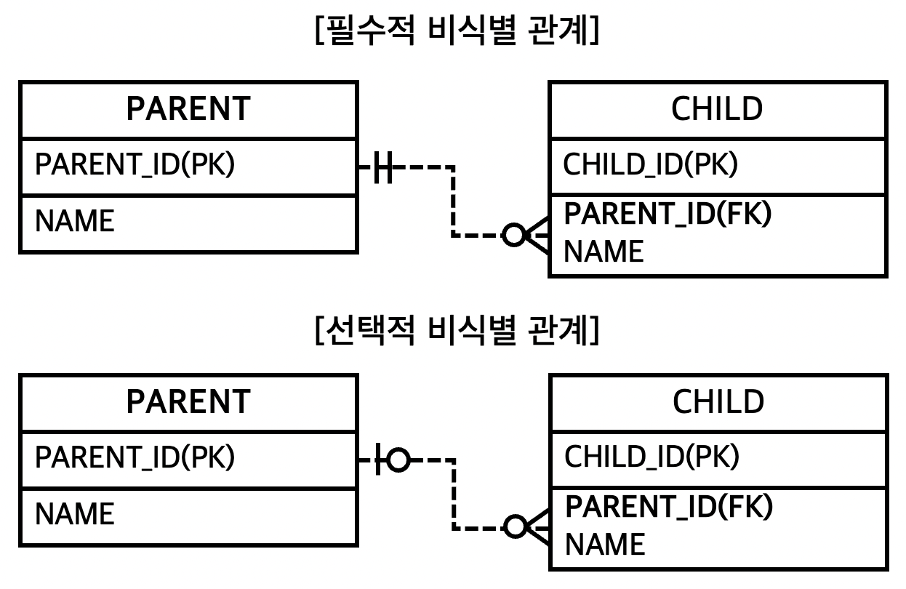

> 부모 테이블의 기본 키를 받아서 자식 테이블의 외래 키로만 사용하는 관계
>
>
> 비식별 관계는 외래 키에 NULL을 허용하는지에 따라 필수적, 선택적 관계로 나뉜다.
>
- **필수적 비식별 관계**(Mandatory) : 외래 키에 NULL을 허용하지 않는다. 연관관계를 필수적으로 맺어야 한다.
- **선택적 비식별 관계**(Optional) : 외래 키에 NULL을 허용, 연관관계를 맺을지 말지 선택가능

## 7.3.2 복합 키: 비식별 관계 매핑

> 복합 키를 사용할 거라고 `@Id`를 두 번 사용하면 매핑 예외가 발생한다.
>
>
> JPA는 영속성 컨텍스트에 엔티티를 보관할 때 엔티티의 식별자를 키로 사용한다.
>
> 그런데 식별자 필드가 2개 이상이면 별도의 식별자 클래스를 만들고 그곳에 equals와 hashcode를 구현해야 한다.
>
> JPA는 복합 키를 지원하기 위해 두 가지 방식을 지원한다.
>
> - `@IdClass` : ORM에 가까운 방법
> - `@EmbeddedId` : 객체지향에 가까운 방법

### `@IdClass`

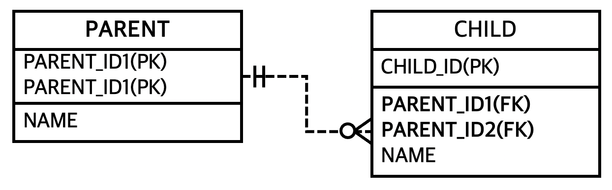

> 위 그림에서 복합 키 테이블은 비식별 관계고 PARENT는 기본 키를 사용한다.
>

*`Parent`*

```java
@Getter
@Setter
@Entity
@IdClass(ParentId.class)
public class Parent {
    //
    @Id
    @Column(name = "PARENT_ID1")
    private String id1; //ParentId.id1과 연결

    @Id
    @Column(name = "PARENT_ID2")
    private String id2; //ParentId.id2과 연결

    private String name;
}
```

*`ParentId`*

```java
@NoArgsConstructor
@AllArgsConstructor
public class ParentId implements Serializable {
    //
    private String id1;
    private String id2;
}
```

<aside>
💡 `@IdClass`를 사용할 때 식별자 클래스는 다음 조건을 만족해야 한다.

- 식별자 클래스의 속성명과 엔티티에서 사용하는 식별자의 속성명이 같아야 한다.
- Serializable 인터페이스를 구현해야한다.
- 기본 생성자가 있어야 한다.
- 식별자 클래스는 public이어야 한다.
</aside>

**저장 코드 실행**

> 아래 코드를 보면 식별자 클래스인 `ParentId`가 보이지 않는데, `em.persist()`를 호출하면 영속성 컨텍스트에 엔티티를 등록하기 직전에 내부에서 `parent.setId1`, `parent.setId2`를 사용해서 식별자 클래스인 `ParentId`를 생성하고 영속성 컨텍스트의 키로 사용한다.
>

```java
public static void saveParent(EntityManager em) {
    //
    Parent parent = new Parent();
    parent.setId1("myId1");
    parent.setId2("myId2");
    parent.setName("parentName");
    em.persist(parent);
}
```

> 동작 쿼리
>
>
> 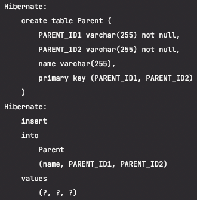
>

> `ParentId` 생성 확인을 위해 아래처럼 `ParentId`를 변경했다.
>
>
> ```java
> public class ParentId implements Serializable {
>     //
>     private String id1;
>     private String id2;
> 
>     public ParentId() {
>         //
>         System.out.println("ParentId NoArg 생성자 동작 확인");
>     }
> 
>     public ParentId(String id1, String id2) {
>         //
>         System.out.println("ParentId AllArg 생성자 동작 확인");
>         this.id1 = id1;
>         this.id2 = id2;
>     }
> }
> ```
>
> 동작 확인... 왜 세번 생성되는걸까?
>
> 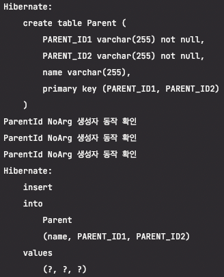
>

**복합 키 조회**

> 조회 코드에서는 식별자 클래스인 `ParentId`를 사용해서 엔티티를 조회한다.
>

```java
public static void findParent(EntityManager em) {
    //
    ParentId parentId = new ParentId("myId1", "myId2");
    Parent parent = em.find(Parent.class, parentId);
}
```

> 동작 쿼리
>
>
> 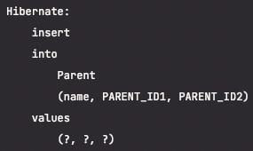
>

**자식 클래스 추가**

> 부모의 기본 키 컬림이 복합 키 이므로 자식 테이블의 외래 키도 복합키이다.
>

```java
@Getter
@Setter
@Entity
public class Child {
    //
    @Id
    private String id;

    @ManyToOne
    @JoinColumns({
            @JoinColumn(name = "PARENT_ID1",
	            referencedColumnName = "PARENT_ID1"),
            @JoinColumn(name = "PARENT_ID2",
	            referencedColumnName = "PARENT_ID2")
    })
    private Parent parent;
}
```

### `@EmbeddedId`

> @IdClass보다 더 객체지향적인 방법
>

예제 코드는 중복을 피하기 위해 앞에 Em을 붙였다.

*`Parent`*

> `Parent`엔티티에서 식별자 클래스를 직접 사용하고 `@EmbeddedId`어노테이션을 사용하면 된다.
>

```java
@Getter
@Setter
@NoArgsConstructor
@Entity
public class EmParent {
    //
    @EmbeddedId
    private EmParentId id;
    private String name;
}
```

*`ParentId`*

> `@IdClass`와는 다르게 `@EmbeddedId`를 적용한 식별자 클래스는 기본 키를 직접 매핑한다.
>

```java
@Getter
@Setter
@NoArgsConstructor
@EqualsAndHashCode
@Embeddable
public class EmParentId implements Serializable {
    //
    @Column(name = "PARENT_ID1")
    private String id1;
    @Column(name = "PARENT_ID2")
    private String id2;
}
```

<aside>
💡 `@EmbeddedId`를 적용한 식별자 클래스의 조건

- `@Embeddable` 어노테이션을 붙여주어야 한다.
- *`Serializable`* 인터페이스를 구현해야 한다.
- equals, hashCode를 구현해야 한다. → *`@EqualsAndHashCode`*
- 기본 생성자가 있어야 한다. → *`@NoArgsConstructor`*
- 식별자 클래스는 public이어야 한다.
</aside>

저장 코드

```java
public static void saveEmbedded(EntityManager em) {
    //
    EmParent parent = new EmParent();
    EmParentId parentId = new EmParentId("myId1", "myId2");
    parent.setId(parentId);
    parent.setName("parentName");
    em.persist(parent);
}
```

> 실행 쿼리
>
>
> 
>

조회 코드

```java
public static void findemParent(EntityManager em) {
    //
    EmParentId parentId = new EmParentId("myId1", "myId2");
    EmParent parent = em.find(EmParent.class, parentId);
    System.out.println(parent.getId().getId1());
    System.out.println(parent.getId().getId2());
    System.out.println(parent.getName());
}
```

### 복합 키와 `equals()`, `hashCode()`

> 영속성 컨텍스트는 엔티티의 식별자를 키로 사용해서 엔티티를 관리한다.
>
>
> 식별자를 비교할 때 equals(), hashCode()를 사용한다.
>
> ⇒ 식별자의 동등성(equals비교)가 지켜지지 않으면 예상과 다른 엔티티가 조회되거나 엔티티를 찾을 수 없는 등의 문제가 발생한다.
>
> ⇒ `equals()`, `hashCode()`를 필수로 구현해야 한다.
>

<aside>
💡 참고

복합 키에는 @GenerateValue를 사용할 수 없다

</aside>

## 7.3.3 복합 키: 식별 관계 매핑

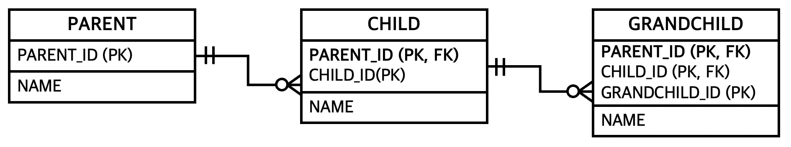

> 부모, 자식, 손자까지 계속 기본 키를 전달하는 식별 관계
>

### `@IdClass`와 식별 관계

*`Parent`*

```java
@Getter
@Setter
@Entity
public class Parent {
    //
    @Id
    @Column(name = "PARENT_ID")
    private String id1; //ParentId.id1과 연결
    private String name;
}
```

*`Child`*

```java
@Getter
@Setter
@Entity
@IdClass(ChildId.class)
public class Child {
    //
    @Id
    @ManyToOne
    @JoinColumn(name = "PARENT_ID")
    private Parent parent;

    @Id
    @Column(name = "CHILD_ID")
    private String childId;

    private String name;
}
```

*`ChildId`*

```java
@Getter
@Setter
@EqualsAndHashCode
public class ChildId implements Serializable {
    //
    private String parent; // Child.parent 매핑
    private String childId; // Child.childId 매핑
}
```

*`GrandChild`*

```java
@Getter
@Setter
@Entity
public class GrandChild {
    //
    @Id
    @ManyToOne
    @JoinColumns ({
            @JoinColumn (name = "PARENT_ID"),
            @JoinColumn (name = "CHILD_ID")
    })
    private Child child;

    @Id
    @Column(name = "GRANDCHILD_ID")
    private String id;

    private String name;
}
```

*`GrandChildId`*

```java
@Getter
@Setter
@EqualsAndHashCode
public class GrandChildId implements Serializable {
    //
    private ChildId childId; // GrandChild.parent 매핑
    private String id;       // GrandChild.id 매핑
}
```

> 식별 관계는 기본 키와 외래 키를 같이 매핑해야 한다.
>
>
> 따라서 식별자 매핑인 `@Id`와 연관관계 매핑인 `@ManyToOne`을 같이 사용하면 된다.
>
> ```java
> @Id // => 기본 키 매핑
> @ManyToOne // => 외래 키 매핑
> 
> @JoinColumn(name = "PARENT_ID")
> private Parent parent;
> ```
>

### `@EmbeddedId`와 식별 관계

*`Parent`*

```java
@Getter
@Setter
@Entity
public class EmParent {
    //
    @Id
    @Column(name = "PARENT_ID")
    private String id;
    private String name;
}
```

*`Child`*

```java
@Getter
@Setter
@Entity
@IdClass(ChildId.class)
public class Child {
    //
    @Id
    @ManyToOne
    @JoinColumn(name = "PARENT_ID")
    private Parent parent;

    @Id
    @Column(name = "CHILD_ID")
    private String childId;

    private String name;
}
```

*`ChildId`*

```java
@Getter
@Setter
@EqualsAndHashCode
@Embeddable
public class EmChildId implements Serializable {
    //
    private String parentId; //@MapsId("parentID")로 매핑

    @Column(name = "CHILD_ID")
    private String id;

}
```

*`GrandChild`*

```java
@Getter
@Setter
@Entity
public class EmGrandChild {
    //
    @EmbeddedId
    private EmGrandChildId id;

    @MapsId("childId")
    @ManyToOne
    @JoinColumns({
            @JoinColumn(name = "PARENT_ID"),
            @JoinColumn(name = "CHILD_ID")
    })
    private EmChild child;
    private String name;
}
```

*`GrandChildId`*

```java
@Getter
@Setter
@EqualsAndHashCode
public class EmGrandChildId implements Serializable {
    //
    private EmChildId childId; //@MapsId("childId") 로 매핑

    @Column(name = "GRANDCHILD_ID")
    private String id;
}
```

> `@EmbeddedId` 로 식별 관계를 구성할 때는 @MapsId를 사용해야 한다.
>
>
> Child엔티티의 parent 필드 확인
>
> ```java
> @Id
> @ManyToOne
> @JoinColumn(name = "PARENT_ID")
> private Parent parent;
> ```
>
> `@IdClass`와의 차이점은 `@Id`대신에 `@MapsId`를 사용한 점이다.
>
> `@MapsId`는 외래 키와 매핑한 연관관계를 기본 키에도 매핑하겠다는 뜻이다.
>
> `@MapsId`의 속성 값은 `@EmbeddedId`를 사용한 식별자 클래스의 기본 키 필드를 지정하면 된다.
>

## 7.3.4 비식별 관계로 구성

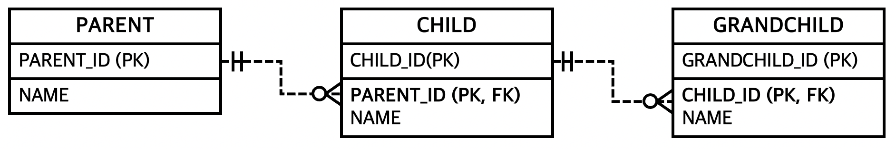

> 식별 관계와 비교하면 매핑, 코드가 단순하다. 또한 복합 키가 없으므로 복합 키 클래스를 만들지 않아도 된다.
>

*`Parent`*

```java
@Getter
@Setter
@Entity
public class Parent {
    //
    @Id
    @GeneratedValue
    @Column(name = "PARENT_ID")
    private Long id;
    private String name;
}
```

*`Child`*

```java
@Getter
@Setter
@Entity
public class Child {
    //
    @Id
    @GeneratedValue
    @Column(name = "CHILD_ID")
    private Long id;
    private String name;

    @ManyToOne
    @JoinColumn(name = "PARENT_ID")
    private Parent parent;
}
```

*`GrandChild`*

```java
@Getter
@Setter
@Entity
public class GrandChild {
    //
    @Id
    @GeneratedValue
    @Column(name = "GRANDCHILD_ID")
    private Long id;
    private String name;

    @ManyToOne
    @JoinColumn(name = "CHILD_ID")
    private Child child;
}
```

## 7.3.5 일대일 식별 관계

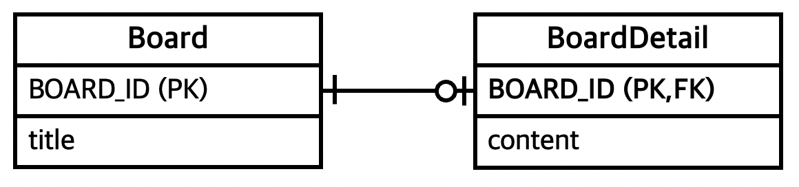

> 일대일 식별 관계는 자식 테이블의 기본 키 값으로 부모 테이블의 기본 키 값만 사용한다.
>
>
> 기본 키가 복합 키가 아니면 자식 테이블의 기본 키는 복합 키로 구성하지 않아도 된다.
>

*`Board`*

```java
@Getter
@Setter
@Entity
public class Board {
    //
    @Id
    @GeneratedValue
    @Column(name = "BOARD_ID")
    private Long id;

    private String title;

    @OneToOne(mappedBy = "board")
    private BoardDetail boardDetail;
}
```

*`BoardDetail`*

```java
@Getter
@Setter
@Entity
public class BoardDetail {
    //
    @Id
    private Long boardId;

    @MapsId // BoardDetail.boardId매핑
    @OneToOne
    @JoinColumn(name = "BOARD_ID")
    private Board board;

    private String content;
}
```

## 7.3.6 식별, 비식별 관계의 장단점

### DB 관점

> DB 설계 관점에서는 아래의 이유로 식별 관계보다는 비식별 관계를 더 선호한다.
>
- 식별 관계는 부모 테이블의 기본 키를 자식 테이블로 전파하면서 자식 테이블의 기본 키 컬럼이 점점 늘어난다
- 식별 관계는 2개 이상의 컬럼을 합해서 복합 기본 키를 만들어야 하는 경우가 많다.
- 식별 관계를 사용할 때 기본 키로 비즈니스 의미가 있는 자연 키 컬럼을 조합하는 경우가 많다.

  반면 비식별 관계의 기본 키는 비즈니스와 전혀 관계없는 대리 키를 주로 사용한다.

  비즈니스의 요구사항은 언젠가 변하는데, 식별 관계의 자연 키 컬럼들이 자식에 손자까지 전파되면 변경하기 힘들다(Cube, Card의 이름을 바꾼다고 생각하면?)

- 식별 관계는 부모 테이블의 기본 키를 자식 테이블의 기본 키로 사용 ⇒ 테이블 구조가 유연하지 못하다.

### 객체 관점

> 객체 관계 매핑의 관점에서는 아래의 이유로 비식별 관계를 더 선호한다.
>
- 식별 관계는 2개 이상의 컬럼을 묶은 복합 기본 키를 사용한다(일대일 제외) → 복합 키 클래스 필요 → 힘듦
- 비식별 관계는 주로 대리 키를 기본 키로 사용하는데, JPA는 `@GenerateValue`로 편하게 생성할 수 있다.

### 식별 관계만의 관점

> 반면 식별 관계가 가지는 장점도 있다.
>
- 기본 키 인덱스 활용이 용이
- 상위 테이블들의 기본 키 컬럼을 자식, 손자가 가지고 있음

  → 특정 상황에 조인 없이 하위 테이블만으로도 검색 가능


### 정리

> **가능하면 비식별 관계 사용, 기본 키는 Long 타입의 대리 키 사용**
>
>
> Integer는 20억 / Long은 약920경 → 훨씬 안전
>
> 선택적 비식별 보다는 필수적 비식별 관계가 추천
>
> → 필수적 비식별 관계는 NOT NULL로 항상 관계가 있다는 것을 보장 ⇒ **내부 조인으로 해결가능**
>