<aside>
💡 개요

- **프록시와 즉시로딩, 지연로딩**

  프록시를 사용하면 연관된 객체를 처음부터 DB에서 조회하는 것이 아니라, 실제 사용하는 시점에 DB에서 조회할 수 있다

  하지만 자주 함께 사용하는 객체들은 조인을 사용해서 함께 조회하는 것이 효과적이다.

  ⇒ JPA는 즉시 로딩과 지연 로딩이라는 방법으로 둘을 모두 지원한다.

- 영속성 전이와 고아 객체

  JPA는 연관된 객체를 함께 저장하거나 함께 삭제할 수 있는 영속성 전이와 고아 객체 제거라는 기능을 제공한다.

</aside>

# 8.1 프록시

> 엔티티를 조회할 때 연관된 엔티티들이 항상 사용되는 것은 아니다.
>
>
> 예를 들어 회원 엔티티를 조회할 때 연관된 팀 엔티티는 비즈니스 로직에 따라 사용될 때도 있지만 그렇지 않을 때도 있다.
>

*`Member`*

```sql
@Entity
@NoArgsConstructor
@AllArgsConstructor
public class Member {
    //
    @Id
    private String id;
    private String username;

    @ManyToOne
    private Team team;
}
```

*`Team`*

```sql
@Entity
@NoArgsConstructor
@AllArgsConstructor
public class Team {
    //
    @Id
    private String id;
    private String name;
}
```

`저장, 출력 로직`

> 출력할 때 회원과 팀 정보를 동시에 출력
>

```sql
public static void saveUserAndTeam(EntityManager em) {
    //
    Team team1 = new Team("Team1","팀1");
    Member member1 = new Member("Member1", "유저1", team1);
    em.persist(team1);
    em.persist(member1);
}

public static void printUserAndTeam(EntityManager em) {
    //
    Member member = em.find(Member.class, "Member1");
    Team team = member.getTeam();
    System.out.println("회원 이름 :: " + member.getUsername());
    System.out.println("소속팀 :: " + team.getName());
}
```

> 출력 결과
>
>
> 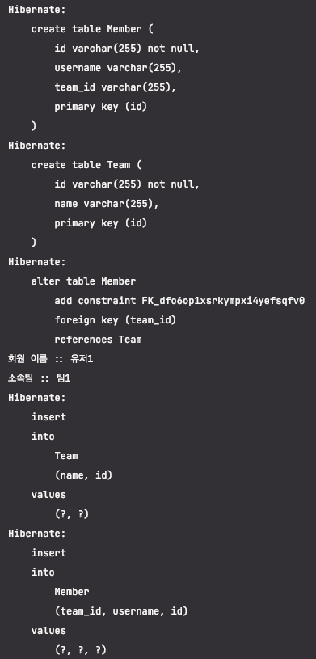
>

`팀 정보만 출력하는 로직`

```sql
public static void printUser(EntityManager em) {
    //
    Member member = em.find(Member.class, "Member1");
    System.out.println("회원 이름 :: " + member.getUsername());
}
```

> 회원만 사용 → 회원 엔티티를 조회할 때 팀까지 사용하는 것은 효율적이지 못하다.
>

<aside>
💡 JPA는 위와 같은 문제를 해결하기 위해 엔티티가 실제 사용될 때까지 DB조회를 지연하는 방법을 제공

⇒ 이를 지연 로딩이라고 한다.

하지만 지연 로딩을 사용하기 위해서는 실제 엔티티 객체 대신에 DB조회를 지연할 수 있는 가짜 객체가 필요한데, 이것을 프록시 객체라고 한다.

</aside>

## 8.1.1 프록시 기초

> JPA엔티티 조회 - `EntityManager.find()`
>
>
> 이 메소드는 영속성 컨텍스트에 엔티티가 없으면 DB를 조회한다.
>

```sql
Member member = em.find(Member.class, "Member1");
```

> 이렇게 직접 조회하면 엔티티를 실제 사용하든 사용하지 않든 DB를 조회한다.
>
>
> 엔티티를 실제 사용시점까지 DB조회를 미루고 싶으면 `EntityManager.getReference()`메소드를 사용하면 된다.
>

```sql
Member member = em.getReference(Member.class, "Member1");
```

> 이 메소드를 호출할 때 JPA는 DB를 조회하지 않고 실제 엔티티 객체도 생성하지 않는다.
>
>
> 대신 DB접근을 위임한 프록시 객체를 반환한다.
>

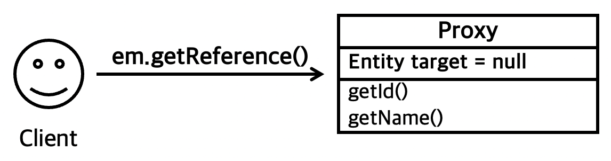

### 프록시의 특징

> 프록시 클래스는 실제 클래스를 상속받아서 만들어진다. → 실제 클래스와 겉 모양이 같다
>
>
> **⇒ 사용하는 입장에서는 이것이 진짜 객체인지 프록시 객체인지 구분하지 않고 사용하면 된다.**
>

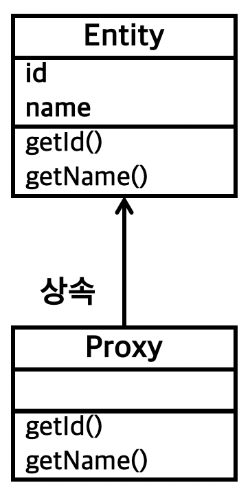

> 프록시 객체는 실제 객체에 대한 참조(target)을 보관한다.
>
>
> 그리고 **프록시 객체의 메소드를 호출하면 프록시 객체는 실제 객체의 메소드를 호출**한다.
>

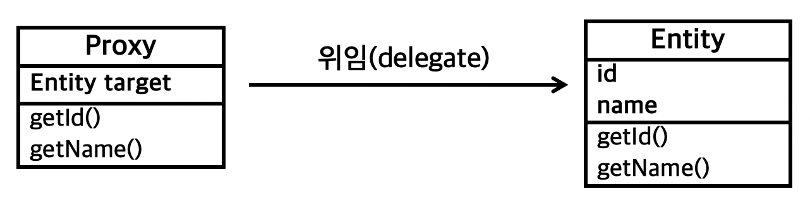

### 프록시 객체의 초기화

> 프록시 객체는 `member.getName()`처럼 **실제 사용될 때 DB를 조회해서 실제 엔티티 객체를 생성**한다.
>
>
> ⇒ 이를 프록시 객체의 초기화 라고 한다.
>

```sql
//객체의 초기화 예제
public static void proxyReturn(EntityManager em) {
    //
    Member member = em.getReference(Member.class, "Member1");
    System.out.println(member.getUsername());
}
```

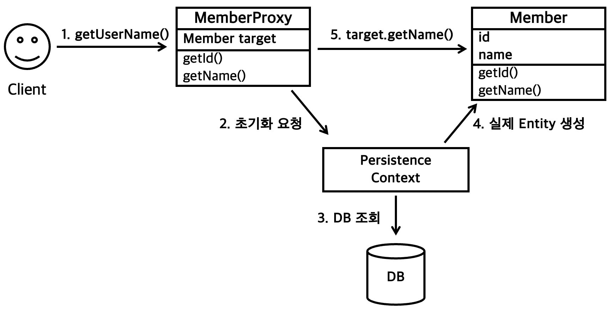

> 프록시의 초기화 과정
>
> 1. 프록시 객체에 .getUserName()을 호출해서 실제 데이터를 조회한다.
> 2. 프록시 객체는 실제 엔티티가 생성되어 있지 않으면 영속성 컨텍스트에 실제 엔티티 생성을 요청한다 → 이를 초기화라 한다.
> 3. 영속성 컨텍스트는 DB를 조회해서 실제 엔티티 객체를 생성한다.
> 4. 프록시 객체는 생성된 실제 엔티티 객체의 참조를 Member target 멤버 변수에 저장
> 5. 프록시 객체는 실제 엔티티 객체의 getName()을 호출해서 결과를 반환한다.

### 프록시의 특징

- 처음 사용할 때 한 번만 초기화 된다.
- 프록시 객체를 초기화 한다고 실제 엔티티 객체가 되는 것은 아니다.

  프록시 객체가 초기화되면 이를 통해서 실제 엔티티에 접근할 수 있다.

- 프록시 객체는 원본 엔티티를 상속받은 객체이다 → 타입 체크시에 주의해야 한다.
- 영속성 컨텍스트에 찾는 엔티티가 있으면 DB를 조회할 필요가 없다

  ⇒ `em.getReference()`를 호출해도 프록시가 아닌 실제 엔티티를 반환한다.

- 초기화는 영속성 컨텍스트의 도움을 받아야 가능하다.

  준영속 상태의 프록시를 초기화 하면 `LazyInitalizationException`을 발생시킨다.

  ### 실험

  > `em.detach(member1);`로 준영속화 시킨 후 같은 코드 실행
  >

    ```sql
    public static void saveUserAndTeam(EntityManager em) {
        //
        Team team1 = new Team("Team1","팀1");
        Member member1 = new Member("Member1", "유저1", team1);
        em.persist(team1);
        em.persist(member1);
        em.detach(member1);
    }
    ```

  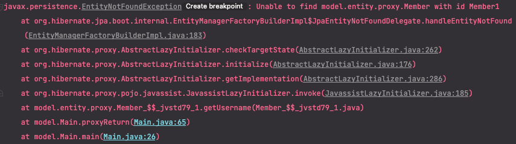

  > 위의 방식으로는 테스트가 되지 않는것 같았다. -그래도 Proxy의 LazyInitalizer위치는 찾을 수 있었다.


### 준영속 상태와 초기화

> `em.close()`로 영속성 컨텍스트를 종료해서 member는 준영속 상태다.
>
>
> `member.getName()`을 호출하면 프록시를 초기화 해야 하는데 영속성 컨텍스트가 없으므로 실제 엔티티를 조회할 수 없다. ⇒ 예외 발생
>

```sql
//테스트 코드
public static void main(String[] args) {

    //엔티티 매니저 팩토리 생성
    EntityManagerFactory emf = Persistence.createEntityManagerFactory("Java_JPA_H2_Test");
    EntityManager em = emf.createEntityManager(); //엔티티 매니저 생성

    EntityTransaction tx = em.getTransaction(); //트랜잭션 기능 획득
    tx.begin(); //트랜잭션 시작
    Member member = em.getReference(Member.class, "Member1");
    tx.commit();//트랜잭션 커밋
    em.close(); //엔티티 매니저 종료

    System.out.println(member.getUsername()); // 호출

    emf.close(); //엔티티 매니저 팩토리 종료
}
```

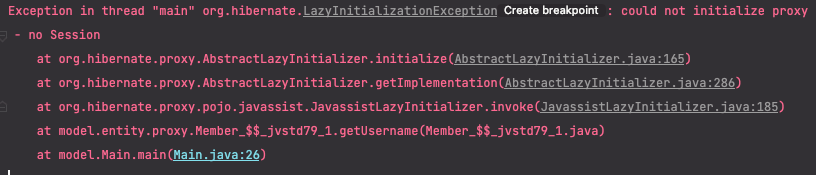

<aside>
💡 JPA 표준 명세는 지연 로딩(프록시)에 대한 내용을 JPA 구현체에 맡겼다.

⇒ 준영속 상태의 엔티티를 초기화 할 때 어떤 일이 발생할 때 표준 명세에는 정의되어 있지 않다.

하이버 네이트를 사용하면 `org.hibernate.LazyInitializationException`를 발생시킨다.

</aside>

## 8.1.2 프록시와 식별자

> 엔티티를 프록시로 조회할 때 식별자(PK) 값을 파라미터로 전달하는데 프록시 객체는 이 값을 보관한다.
>

```sql
Team team = em.getReference(Team.class, "Team1"); //식별자 보관
team.getId(); // 초기화 되지 않음
```

> 프록시 객체는 식별자 값을 가지고 있으므로 getId()를 호출해도 프록시를 초기화 하지 않는다.
>
>
> 단, 엔티티 접근 방식을 필드 :: @Access(AccessType.FIELD))로 설정한 경우 어떤 일을 하는 메소드인지 알지 못하므로 프록시 객체를 초기화 한다.
>

<aside>
💡 프록시의 유용성

프록시는 아래처럼 연관관계를 설정할 때 유용하게 사용할 수 있다.

```sql
Member member = em.find(Member.class, "Member1");
Team team = em.getReference(Team.class, "Team1"); // SQL을 실행하지 않음
member.setTeam(team);
```

연관관계를 설정할 때는 식별자 값만 사용하므로 **프록시를 사용하면 DB 접근 횟수를 줄일 수 있다.**

</aside>

비교 코드

1. find만 사용하는 경우 → select 쿼리가 두 번 실행된다.

    ```sql
    public static void proxyCompare(EntityManager em) {
        //
        Member member = em.find(Member.class, "Member1");
        Team team = em.find(Team.class, "Team1"); // SQL을 실행
        member.setTeam(team);
        System.out.println(team.getName());
    }
    ```

   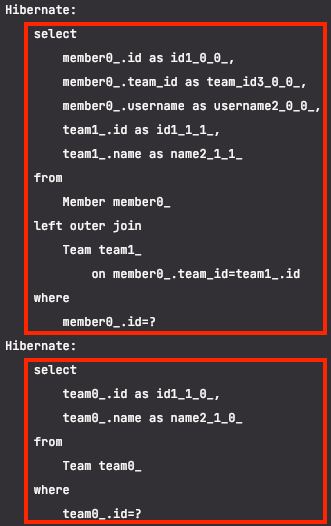

2. Proxy를 사용하는 경우 → select가 한 번만 실행된다.

    ```sql
    public static void proxyReturn(EntityManager em) {
        //
        Member member = em.find(Member.class, "Member1");
        Team team = em.getReference(Team.class, "Team1"); // SQL을 실행하지 않음
        member.setTeam(team);
        System.out.println(team.getName());
    }
    ```

   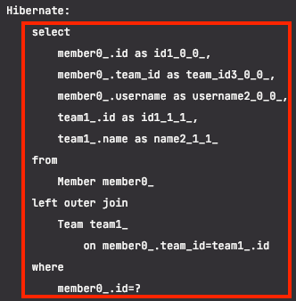


## 8.1.3 프록시 확인

> `PersistenceUnitUtil.isLoaded(Object entity)`를 사용하면 프록시 인스턴스의 초기화 여부를 확인할 수 있다. - 아직 초기화 되지 않은 경우 false를 반환한다.
>

```sql
public static void proxyLoadCheck(EntityManager em) {
    //
    Team team = em.getReference(Team.class, "Team1");
    boolean isLoad = em.getEntityManagerFactory()
            .getPersistenceUnitUtil().isLoaded(team);
    System.out.println("isLoad ::: " + isLoad);
}
```

> 조회한 엔티티가 진짜인지 프록시인지 확인하려면 클래스 명을 직접 출력해보면 된다.
>
>
> 클래스 명 뒤에 `..javassist..`라 되어 있으면 프록시인 것이다.
>

```sql
public static void proxyLoadCheck(EntityManager em) {
    //
    Team team = em.getReference(Team.class, "Team1");
    System.out.println("Proxy Check ::: " + team.getClass().getName());
}
```

출력결과 - 프록시를 생성하는 라이브러리에 따라 결과가 달라질 수 있다.

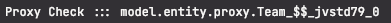

<aside>
💡 프록시 강제 초기화

`iniitalize()`메소드를 사용하면 프록시를 강제로 초기화 할 수 있다.

단, JPA표준에는 없는 메소드이므로 직접 호출하면 된다.

</aside>

# 8.2 즉시 로딩과 지연 로딩

> 프록시 객체는 주로 연관된 엔티티를 지연 로딩할 때 사용한다.
>

member1이 team1에 소속해 있다고 가정한다.

```sql
Member member = em.find(Member.class, "Member1");
Team team = member.getTeam(); // 객체 그래프 탐색
System.out.println(team.getName()); // 팀 엔티티 사용
```

<aside>
💡 JPA가 제공하는 조회 시점 선택 방법

- **즉시 로딩** : 엔티티를 조회할 때 연관된 엔티티도 함께 조회한다.
    - 예 : `em.find(Member.class, "Member1")`를 호출할 때 회원 엔티티와 연관된 팀 엔티티도 함께 조회한다.
    - 설정 방법 : `@ManyToOne(fetch = FetchType.EAGER)`
- **지연 로딩** : 연관된 엔티티를 실제 사용할 때 조회한다.
    - 예 : `member.getTeam().getName()`처럼 조회한 팀 엔티티를 실제 사용하는 시점에 JPA가 SQL을 호출해서 팀 엔티티를 조회한다.
    - 설정 방법 : `@ManyToOne(fetch = FetchType.Lazy)`
</aside>

## 8.2.1 즉시 로딩(EAGER LOADING)

```sql
//즉시 로딩 지정
@Entity
@NoArgsConstructor
@AllArgsConstructor
public class Member {
    //
    @Id
    private String id;
    private String username;

    @ManyToOne(fetch = FetchType.EAGER)
    @JoinColumn(name = "TEAM_ID")
    private Team team;
}
```

즉시 로딩, 회원을 조회할 때 팀 즉시 로딩

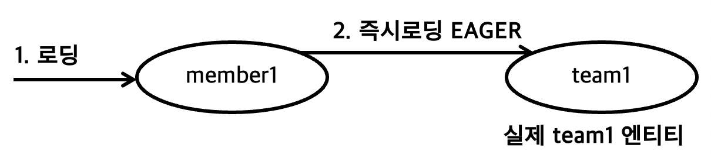

> 회원을 조회하는 순간 팀도 함께 조회한다.
>
>
> 쿼리를 두 번 실행하는 것처럼 보이지만 JPA구현체는 즉시 로딩을 최적화 하기 위해 가능하면 조인 쿼리를 사용한다.
>
> 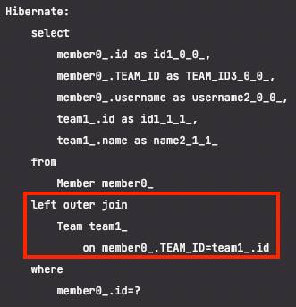
>

<aside>
💡 위의 쿼리에서 Inner Join이 아닌 Outer Join을 사용한 것을 유심히 봐야 한다.

현재 회원 테이블에 Team_Id 외래 키는 NULL을 허용하고 있다 → 팀에 소속되지 않은 회원이 있을 수 있다. ⇒ 이런 회원들과 팀을 내부 조인하면 팀과 회원 데이터를 조회할 수 없다.

JPA는 이런 상황을 고려해서 Outer Join을 사용한다.

하지만 Inner Join이 성능, 최적화에서는 더 유리하다. → Inner Join을 굳이 사용하려면?

⇒ 외래 키에 Not Null 제약 조건 설정을 해주어야 한다.

**nullable 설정에 따른 조인 전략**

```sql
@JoinColumn(nullable = true)  // Null 허용, 외부 조인 사용
@JoinColumn(nullable = false) // Null 허용하지 않음, 내부 조인 사용
```

- 사용예

    ```sql
    @Entity
    public class Member {
        //
        @Id
        private String id;
        private String username;
    
        @ManyToOne(fetch = FetchType.EAGER)
        @JoinColumn(name = "TEAM_ID", nullable = false)
        private Team team;
    }
    ```

  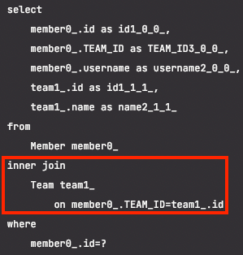


또는 *`@ManyToOne`*의 optional로 내부 조인을 설정할 수 있다.

```sql
@ManyToOne(fetch = FetchType.EAGER, optional = false)
```

- 사용예

    ```sql
    @Entity
    public class Member {
        //
        @Id
        private String id;
        private String username;
    
        @ManyToOne(fetch = FetchType.EAGER, optional = false)
        @JoinColumn(name = "TEAM_ID")
        private Team team;
    }
    ```

  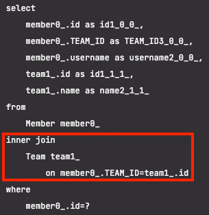

</aside>

## 8.2.2 지연 로딩(LAZY LOADING)

> 지연 로딩을 사용하려면 *`@ManyToOne`*의 속성을 LAZY로 지정한다.`(fetch = *FetchType*.LAZY)`
>

```sql
@Entity
public class Member {
    //
    @Id
    private String id;
    private String username;

    @ManyToOne(fetch = FetchType.LAZY)
    @JoinColumn(name = "TEAM_ID")
    private Team team;
}
```

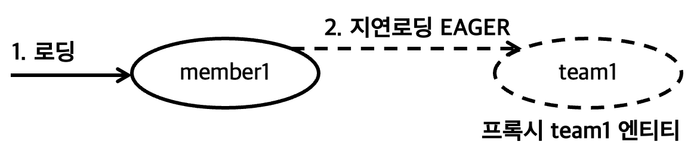

```sql
public static void findMember(EntityManager em) {
    //
    Member member = em.find(Member.class, "Member1");
    Team team = member.getTeam(); // 객체 그래프 탐색
    System.out.println(team.getName()); // 팀 엔티티 사용
}
```

> 지연 로딩을 설정했기 때문에 *`em*.find(*Member*.*class*, "Member1")`를 호출하면 회원만 조회하고 팀은 조회 하지 않는다.
>
>
> 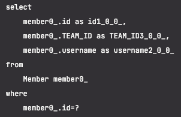
>
> 대신 위의 그림과 같이 team 멤버 변수에 프록시 객체를 넣어준다.
>
> 즉, *`Team* team = member.getTeam();` 로 반환된 객체는 프록시 객체이다.
>
> 이 데이터는 실제 사용될 때 까지 데이터 로딩을 미룬다. 그래서 지연 로딩이라 한다.
>

<aside>
💡 조회 대상이 영속성 컨텍스트에 이미 있으면 프록시 객체를 사용할 이유가 없다.

→ 프록시 객체가 아니라 실제 객체를 사용한다.

</aside>

## 8.2.3 즉시 로딩, 지연 로딩 정리

### 지연 로딩

> 연관된 엔티티를 프록시로 조회
>
>
> 프록시를 실제 사용할 때 초기화 하면서 DB를 조회한다.
>

### 즉시 로딩

> 연관된 엔티티를 즉시 조회한다.
>
>
> 하이버네이트는 가능하면 SQL 조인을 사용해서 한 번에 조회한다.
>

# 8.3 지연 로딩 활용

클래스 모델

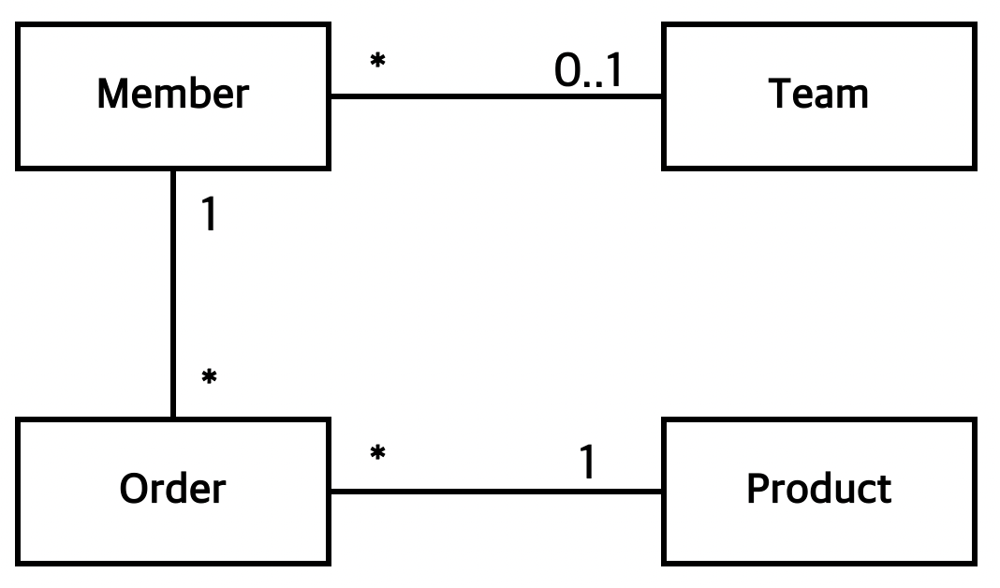

회원 엔티티

```sql
@Entity
@NoArgsConstructor
@AllArgsConstructor
public class Member {
    //
    @Id
    private String id;
    private String username;
    private Integer age;

    @ManyToOne(fetch = FetchType.EAGER)
    private Team team;

    @OneToMany(mappedBy = "member", fetch = FetchType.LAZY)
    private List<Order> orders;
}
```

> 코드 분석
>
>
> ```sql
> @ManyToOne(fetch = FetchType.EAGER)
> private Team team;
> ```
>
> ⇒ 회원 엔티티를 조회하면 팀 엔티티도 즉시 조회한다.
>
> ⇒ `FetchType.EAGER`로 설정했으므로 하이버네이트는 조인 쿼리를 만들어 회원과 팀을 한 번에 조회한다.
>
> ```sql
> @OneToMany(mappedBy = "member", fetch = FetchType.LAZY)
> private List<Order> orders;
> ```
>
> ⇒ 회원 엔티티를 조회하면 연관된 주문 내역 엔티티는 프록시로 조회해서 실제 사용될 때까지 로딩을 지연
>
> ⇒ `FetchType.LAZY`로 설정했으므로 결과를 프록시로 조회한다. → SQL에 나타나지 않는다.
>

## 8.3.1 프록시와 컬렉션 래퍼

### 컬렉션 래퍼

> 하이버네이트는 엔티티를 영속 상태로 만들 때 엔티티에 컬렉션이 있으면 컬렉션을 추적하고 관리할 목적으로 원본 컬렉션을 하이버네이트가 제공하는 내장 컬렉션으로 변경하는데, 이것을 컬렉션 래퍼라 한다.
>
>
> 위의 Order같은 컬렉션은 컬렉션 래퍼가 지연 로딩 처리를 해준다.
>

## 8.3.2 JPA 기본 페치(fetch) 전략

### JPA의 기본 페치 전략

- 연관 엔티티가 하나 → 즉시 로딩
- 연관 엔티티가 컬렉션 → 지연 로딩

  ⇒ 컬렉션을 로딩 하는 것은 비용이 많이 들고 잘못하면 너무 많은 데이터를 로딩할 수 있기 때문


<aside>
💡 추천하는 방법은 모든 연관관계에 지연 로딩을 사용하는 것이다.

애플리케이션 개발이 어느정도 완료단계일 경우 실제 사용하는 상황을 보고 꼭 필요한 곳에만 즉시 로딩을 사용하도록 최적화

</aside>

## 8.3.3 컬렉션에 `FetchType.EAGER` 사용 시 주의점

- 컬렉션을 하나 이상 즉시 로딩하는 것은 권장하지 않음

  > 서로 다른 컬렉션을 2개 이상 조인할 때 너무 많은 데이터를 반환할 수 있다.
  >
  >
  > 예) A테이블을 N, M 두 테이블과 일대다 조인 ⇒ SQL 실행 결과가 N 곱하기 M이 된다.
  >
  > JPA는 이렇게 조회된 결과를 메모리에서 필터링해서 반환하므로 직접적인 성능 저하의 원인이 된다.


- 컬렉션 즉시 로딩은 항상 외부조인을 사용한다.

  > 예)
  >
  >
  > 다대일 관계 - 회원 테이블과 팀 테이블 조인
  >
  > 회원 테이블의 외래 키에 not null을 걸면 모든 회원은 팀에 소속 → 내부 조인 가능
  >
  > 반대로 팀 테이블에서 회원 테이블로 일대다 관계 조인
  >
  > 회원이 한 명도 없는 팀을 내부 조인 → 팀까지 조회되지 않는 문제 발생
  >
  > 이런 상황을 DB제약 조건으로 막을 수는 없다.
  >
  > ⇒ JPA는 일대다 관계를 즉시 로딩할 때 항상 외부조인을 사용한다.


### *`FetchType*.EAGER` 설정과 조인 전략 정리

- *`@ManyToOne`, `@OneToOne`*
    - `(optional = false)` : 내부 조인
    - `(optional = true)`   : 외부 조인
- *`@OneToMany`, `@ManyToMany`*
    - `(optional = false)` : 외부 조인
    - `(optional = true)`   : 외부 조인

# 8.4 영속성 전이 : CASCADE

> 특정 엔티티를 영속 상태로 만들 때 연관된 엔티티도 함꼐 영속 상태로 만들고 싶으면 영속성 전이(transitive persistence) 기능을 사용하면 된다.
>
>
> 예) 부모를 저장할 때 자식도 함께 저장할 수 있다.
>

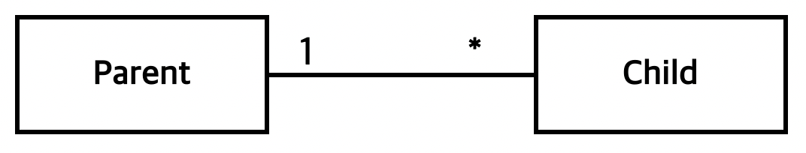

*`Parent`*

```sql
@Entity
public class Parent {
    //
    @Id
    @GeneratedValue
    private long id;

    @OneToMany(mappedBy = "parent")
    private List<Child> children  = new ArrayList<>();
}
```

*`Child`*

```sql
@Entity
public class Child {
    //
    @Id
    @GeneratedValue
    private long id;

    @ManyToOne
    private Parent parent;
}
```

> 부모 한 명에 두 명의 자식을 저장
>

```sql
public static void saveNoCascade(EntityManager em) {
	  //
	  //부모 저장
	  Parent parent = new Parent();
	  em.persist(parent);
	
	  //1번 자식
	  Child child1 = new Child();
	  child1.setParent(parent);
	  parent.getChildren().add(child1);
	  em.persist(child1);
	
	  //2번 자식
	  Child child2 = new Child();
	  child1.setParent(parent);
	  parent.getChildren().add(child2);
	  em.persist(child2);
}
```

> **JPA에서 엔티티를 저장할 때 연관된 모든 엔티티는 영속 상태여야 한다.**
>
>
> 위에서는 부모, 자식 모두 영속 상태로 만든다.
>
> 이럴 때 영속성 전이를 사용하면 부모만 영속 상태로 만들면 연관된 자식까지 한 번에 영속상태로 만들 수 있다.
>

## 8.4.1 영속성 전이: 저장

*`Parent`*

> 부모를 영속화 할 때 연관된 자식들도 함께 영속화하기 위해 `cascade = CascadeType.PERSIST` 옵션을 사용
>

```sql
@Entity
public class Parent {
    //
    @Id
    @GeneratedValue
    private long id;

    @OneToMany(mappedBy = "parent", cascade = CascadeType.PERSIST)
    private List<Child> children  = new ArrayList<>();
}
```

> 저장 코드 - persist는 부모 엔티티만 해주었다.
>

```sql
public static void saveWithCascade(EntityManager em) {
    //
    Child child2 = new Child();
    Child child1 = new Child();

    Parent parent = new Parent();
    //연관관계 추가
    child1.setParent(parent);
    child1.setParent(parent);

    parent.getChildren().add(child1);
    parent.getChildren().add(child2);

    em.persist(parent);
}
```

> 실행 쿼리
>
>
> 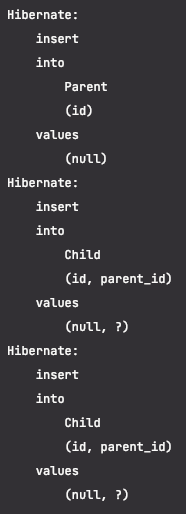
>

<aside>
💡 영속성 전이는 연관관계를 매핑하는 것과는 아무 관련이 없다.

단지 엔티티를 영속화할 때 연관된 엔티티도 같이 영속화하는 편리함을 제공할 뿐이다.

</aside>

## 8.4.2 영속성 전이: 삭제

> 부모와 자식을 모두 제거 하려면 각각의 엔티티를 하나씩 제거해야 한다.
>
>
> (이 때 연관된 자식부터 제거해야 한다.)
>
> `cascade = CascadeType.REMOVE`로 설정할 경우 부모 엔티티만 삭제하면 자식 엔티티도 함께 삭제된다. 이렇게 하면 JPA는 연관관계를 고려해서 자식부터 삭제하고 부모를 삭제하는 쿼리를 실행시켜준다.
>

## 8.4.3 CASCADE의 종류

```sql
public enum CascadeType {

    /** Cascade all operations */
    ALL, "모두 적용"

    /** Cascade persist operation */
    PERSIST, "영속"

    /** Cascade merge operation */
    MERGE, "병함"

    /** Cascade remove operation */
    REMOVE,

    /** Cascade refresh operation */
    REFRESH,

    /** Cascade detach operation */
    DETACH
}
```

# 8.5 고아 객체

> 부모 엔티티와 연관관계가 끊어진 자식 엔티티를 자동으로 삭제하는 기능을 **고아 객체(ORPHAN) 제거**라 한다.
>
>
> 이 기능을 사용해서 부모 엔티티의 컬렉션에서 자식 엔티티의 참조만 제거하면 자식 엔티티가 자동으로 삭제되도록 한다.
>

### 기능 설정

*`Parent`*

```sql
@Entity
@NoArgsConstructor
@AllArgsConstructor
public class Parent {
    //
    @Id
    @GeneratedValue
    private long id;

    @OneToMany(mappedBy = "parent", orphanRemoval = true)
    private List<Child> children  = new ArrayList<>();
}
```

### 정리

> 고아 객체 제거는 참조가 제거된 엔티티는 다른 곳에서 참조하지 않는 고아 객체로 보고 삭제하는 기능이다.
>
>
> ⇒ 이 기능은 참조하는 곳이 하나일 때만 사용해야 한다. - 삭제한 엔티티를 다른 곳에서 참조하면 문제 발생
>
> ⇒ `@OneToOne`, `@OneToMany`에만 사용할 수 있다.
>
> 부모를 제거하면 자식은 고아가 된다. ⇒ 자식도 같이 제거 된다.
>

# 8.6 영속성 전이 + 고아 객체, 생명주기

> `cascade = CascadeType`*,*`ALL,orphanRemoval = true`를 동시에 사용하면?
>
>
> ⇒ 엔티티 스스로 생명주기 관리
>
> ⇒ 부모 엔티티를 통해 자식의 생명주기 관리 가능
>